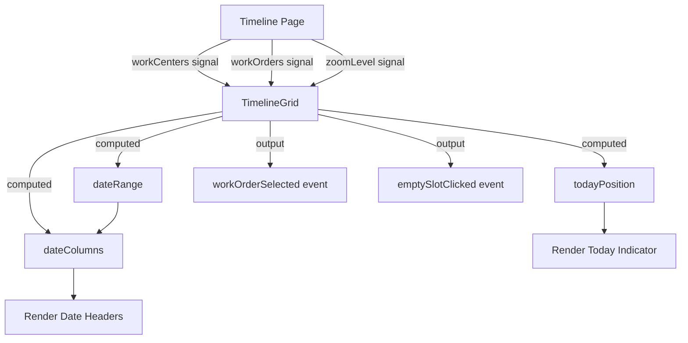

# Phase 2: Timeline Grid Implementation Prompt

## Context

We need to implement the **TimelineGrid organism component**, which is the core visualization component of the work order timeline application. This is Phase 2 of the project, building on the completed foundation (Phase 1: models, services, utilities, folder structure).

**Location:** `src/app/features/timeline/components/organisms/timeline-grid/`

**Parent:** Timeline feature page (`features/timeline/timeline.ts`)

**Purpose:** Display work centers in a fixed left panel and their corresponding timeline in a scrollable right panel, with date columns and a current day indicator.

## Requirements

### Technical Standards

- ✅ Angular 21 standalone component (no NgModule)
- ✅ OnPush change detection strategy
- ✅ Signal-based inputs using `input()`
- ✅ Signal-based outputs using `output()`
- ✅ Dependency injection using `inject()`
- ✅ New control flow syntax (`@if`, `@for`, `@switch`)
- ✅ BEM naming convention for CSS classes
- ✅ TypeScript strict mode compliance (no `any` types)
- ✅ Atomic Design hierarchy (organism level)

### Component Architecture

**Inputs:**

- `workCenters` - Signal input of work center data
- `workOrders` - Signal input of work order data
- `zoomLevel` - Signal input for zoom level ('day' | 'week' | 'month')

**Outputs:**

- `workOrderSelected` - Emits when user clicks on a work order bar (Phase 4)
- `emptySlotClicked` - Emits when user clicks empty timeline area (Phase 6)

**Local State:**

- `currentDate` - Signal for today's date (for current day indicator)
- `dateRange` - Computed signal for visible date range based on zoom level
- `gridColumns` - Computed signal for date column definitions

### Layout Structure

The component must implement a **split-panel layout** with:

1. **Fixed Left Panel** (Work Centers)
   - Width: 200px (fixed)
   - Contains work center names
   - Vertically scrolls with right panel
   - Background: #f8f9fa

2. **Scrollable Right Panel** (Timeline)
   - Width: Flexible (fills remaining space)
   - Horizontally scrollable
   - Contains date columns and work order bars
   - Vertically synchronized with left panel
   - Background: #ffffff

3. **Unified Scroll Container**
   - Both panels scroll vertically together
   - Only right panel scrolls horizontally
   - Uses CSS Grid for layout coordination

### Date Column Rendering

**Requirements:**

1. **Column Generation**
   - Generate columns based on `zoomLevel` signal
   - Day view: Show 14 days (today ± 7 days)
   - Week view: Show 8 weeks (current week ± 3.5 weeks)
   - Month view: Show 6 months (current month ± 2.5 months)

2. **Column Widths**
   - Day view: 120px per column
   - Week view: 140px per column
   - Month view: 180px per column

3. **Column Headers**
   - Day view: "Mon 12/25" format
   - Week view: "Week 52 (Dec 25 - Dec 31)" format
   - Month view: "December 2025" format

4. **Visual Styling**
   - Border between columns: 1px solid #e9ecef
   - Header background: #f8f9fa
   - Header text color: #495057
   - Header font size: 0.875rem (14px)
   - Header padding: 12px 8px

### Current Day Indicator

**Requirements:**

1. **Visual Treatment**
   - Vertical line spanning full height of timeline
   - Color: #5659ff (primary color)
   - Width: 2px
   - z-index: 10 (above grid, below bars)
   - Position: Calculated based on current date and zoom level

2. **Label**
   - "Today" label at top
   - Font size: 0.75rem (12px)
   - Color: #5659ff
   - Background: #ffffff
   - Padding: 4px 8px
   - Border-radius: 4px

3. **Positioning Logic**
   - Calculate pixel offset from left edge of timeline
   - Account for zoom level column widths
   - Update when zoom level changes
   - Hide if current date is outside visible range

### Work Center Rows

**Requirements:**

1. **Row Layout**
   - Height: 60px per row
   - Horizontal padding: 16px in left panel
   - Border bottom: 1px solid #e9ecef

2. **Work Center Name**
   - Font size: 0.9375rem (15px)
   - Font weight: 500
   - Color: #212529
   - Vertical center alignment

3. **Hover State**
   - Background: #f1f3f5 (both panels change)
   - Transition: 0.15s ease

## Design Reference

**Primary Design Files:**

- `brief/design/Work Order Schedule - Default.jpg` - Overall layout and structure
- `brief/design/Work Order Schedule - View Selection.jpg` - Zoom level variations

**Key Measurements to Extract:**

- Left panel width: 200px
- Row height: 60px
- Date column widths: 120px (day), 140px (week), 180px (month)
- Header height: 48px
- Spacing between elements: 16px standard, 8px compact
- Border color: #e9ecef
- Background colors: #f8f9fa (panels), #ffffff (timeline)

**Colors to Match:**

- Primary: #5659ff
- Text primary: #212529
- Text secondary: #495057
- Border: #e9ecef
- Background light: #f8f9fa
- Background white: #ffffff

**Typography:**

- Font family: 'Circular Std', sans-serif
- Work center names: 0.9375rem (15px), weight 500
- Column headers: 0.875rem (14px), weight 400
- Today label: 0.75rem (12px), weight 500

## Implementation Strategy

### Stage 1: Component Structure

**Goal:** Set up component files with basic structure

```typescript
// timeline-grid.ts - Basic structure
- Create standalone component
- Add OnPush change detection
- Define signal inputs (workCenters, workOrders, zoomLevel)
- Define signal outputs (workOrderSelected, emptySlotClicked)
- Inject required services (if any)
- Add constructor logic for computed signals
```

**Verification:** Component compiles without errors, can be imported in timeline page

---

### Stage 2: Layout Implementation

**Goal:** Implement split-panel CSS Grid layout

```scss
// timeline-grid.scss - Layout
- Create BEM base class (.timeline-grid)
- Implement CSS Grid for split panels
- Fixed left panel (200px width)
- Flexible right panel (1fr)
- Unified vertical scroll
- Horizontal scroll for right panel only
```

**Template Structure:**

```html
<div class="timeline-grid">
  <div class="timeline-grid__left-panel">
    <!-- Work center names -->
  </div>
  <div class="timeline-grid__right-panel">
    <div class="timeline-grid__header">
      <!-- Date columns -->
    </div>
    <div class="timeline-grid__content">
      <!-- Timeline grid -->
    </div>
  </div>
</div>
```

**Verification:** Split layout renders correctly, scroll behavior works as expected

---

### Stage 3: Work Center Rendering

**Goal:** Display work centers in left panel

```typescript
// Component logic
- Use @for to iterate over workCenters signal
- Render work center name in each row
- Match row height to design (60px)
- Apply hover states
```

**Verification:** All work centers display correctly, hover states work

---

### Stage 4: Date Column Logic

**Goal:** Calculate and render date columns based on zoom level

```typescript
// Component methods
calculateDateRange(zoomLevel: ZoomLevel): DateRange {
  // Calculate start/end dates based on zoom level
  // Day: today ± 7 days
  // Week: current week ± 3.5 weeks
  // Month: current month ± 2.5 months
}

generateDateColumns(dateRange: DateRange, zoomLevel: ZoomLevel): DateColumn[] {
  // Generate array of date columns
  // Each column has: date, label, width
  // Use date.utils.ts helpers
}
```

**Verification:** Date columns generate correctly for all three zoom levels

---

### Stage 5: Date Column Rendering

**Goal:** Display date columns in header

```html
<!-- timeline-grid.html -->
@for (column of dateColumns(); track column.date) {
<div class="timeline-grid__column" [style.width.px]="column.width">{{ column.label }}</div>
}
```

**Verification:** Date columns display with correct widths and labels for each zoom level

---

### Stage 6: Grid Lines Implementation

**Goal:** Add vertical grid lines between date columns

```scss
// timeline-grid.scss
.timeline-grid__column {
  border-right: 1px solid #e9ecef;
  // Styling for visual grid
}
```

**Verification:** Grid lines visible, columns properly separated

---

### Stage 7: Current Day Indicator

**Goal:** Add "Today" indicator line

```typescript
// Component computed signal
todayPosition = computed(() => {
  const today = new Date();
  const startDate = this.dateRange().start;
  const zoomLevel = this.zoomLevel();

  // Calculate pixel offset from left edge
  return calculateTodayPosition(today, startDate, zoomLevel);
});
```

```html
<!-- timeline-grid.html -->
@if (todayPosition() !== null) {
<div class="timeline-grid__today-indicator" [style.left.px]="todayPosition()">
  <span class="timeline-grid__today-label">Today</span>
</div>
}
```

**Verification:** Today indicator appears at correct position, updates with zoom level changes

---

### Stage 8: Scroll Synchronization

**Goal:** Ensure left and right panels scroll together vertically

```typescript
// Component method
syncVerticalScroll(event: Event) {
  // Keep left panel scroll position in sync with right panel
  // Use ViewChild for panel references if needed
}
```

**Verification:** Both panels scroll together vertically, only right panel scrolls horizontally

---

### Stage 9: Design Verification

**Goal:** Match design files pixel-perfect

**Check:**

- [ ] Panel widths match design
- [ ] Row heights match design (60px)
- [ ] Date column widths match design (120/140/180px)
- [ ] Colors match design exactly
- [ ] Fonts match design (Circular Std, correct sizes)
- [ ] Spacing matches design (16px/8px)
- [ ] Borders match design (1px solid #e9ecef)
- [ ] Hover states match design
- [ ] Today indicator matches design

**Tools:**

- Browser dev tools for measurement
- Color picker for color verification
- Side-by-side comparison with design files

**Verification:** Side-by-side comparison shows pixel-perfect match

---

### Stage 10: TypeScript Strict Mode

**Goal:** Ensure no TypeScript errors

**Check:**

- [ ] No `any` types
- [ ] All signal types defined
- [ ] Proper null/undefined handling
- [ ] No implicit any errors
- [ ] All computed signals properly typed

**Verification:** `ng build` runs without TypeScript errors

---

## Data Flow



## Utilities to Use

**From `date.utils.ts`:**

```typescript
// Expected utility functions (implement if not exist)
- addDays(date: Date, days: number): Date
- addWeeks(date: Date, weeks: number): Date
- addMonths(date: Date, months: number): Date
- startOfWeek(date: Date): Date
- endOfWeek(date: Date): Date
- startOfMonth(date: Date): Date
- endOfMonth(date: Date): Date
- formatDate(date: Date, format: string): string
- differenceInDays(dateLeft: Date, dateRight: Date): number
```

**From `timeline.model.ts`:**

```typescript
// Expected types
export type ZoomLevel = 'day' | 'week' | 'month';

export interface DateRange {
  start: Date;
  end: Date;
}

export interface DateColumn {
  date: Date;
  label: string;
  width: number;
}
```

## Testing Checklist

**Functionality:**

- [ ] Component renders without errors
- [ ] Work centers display in left panel
- [ ] Date columns generate for Day zoom
- [ ] Date columns generate for Week zoom
- [ ] Date columns generate for Month zoom
- [ ] Today indicator appears at correct position
- [ ] Vertical scroll syncs between panels
- [ ] Horizontal scroll works on right panel only
- [ ] Hover states work on rows
- [ ] Zoom level changes update columns correctly

**Design Accuracy:**

- [ ] Left panel width: 200px
- [ ] Row height: 60px
- [ ] Date column widths correct for each zoom level
- [ ] Colors match design files
- [ ] Fonts match design (Circular Std)
- [ ] Spacing matches design
- [ ] Borders match design
- [ ] Today indicator styling matches design

**Code Quality:**

- [ ] TypeScript strict mode passes
- [ ] OnPush change detection working
- [ ] All signals properly defined
- [ ] BEM naming consistent
- [ ] No console errors or warnings
- [ ] Component follows Atomic Design (organism level)

## Definition of Done

- [x] Component structure created with all required files
- [x] Split-panel layout implemented with CSS Grid
- [x] Work centers render in fixed left panel
- [x] Date columns generate based on zoom level
- [x] Date columns render with correct widths and labels
- [x] Current day indicator appears at correct position
- [x] Vertical scroll synchronization works
- [x] Horizontal scroll works on right panel
- [x] Hover states implemented
- [x] Design matches pixel-perfect (compared side-by-side)
- [x] TypeScript strict mode passes (no errors)
- [x] OnPush change detection working correctly
- [x] All signals properly typed
- [x] BEM naming used consistently
- [x] No console errors or warnings
- [x] Memory bank updated (progress.md, activeContext.md)

## After Completion

**Update Memory Bank:**

```markdown
**Recent Changes:**

- TimelineGrid component fully implemented
- Split-panel layout with fixed/scrollable sections
- Date column rendering for all zoom levels
- Current day indicator working
- Scroll synchronization implemented

**Files to Update:**

- progress.md: Mark Phase 2 as complete
- activeContext.md: Document grid layout patterns, move focus to Phase 3
- systemPatterns.md: Add timeline positioning algorithm, date calculation strategy

**New Patterns Discovered:**

- CSS Grid split-panel technique
- Scroll synchronization approach
- Date range calculation per zoom level
- Today indicator positioning algorithm
```

## Notes

- **Do not implement work order bars yet** - That's Phase 4
- **Do not implement zoom control yet** - That's Phase 3 (we'll receive zoom level as input for now)
- **Focus on layout and date rendering only** - Get the foundation solid before adding interactions
- **Test with all three zoom levels** - Ensure columns render correctly for day/week/month
- **Verify scroll behavior carefully** - Split panel scrolling is tricky to get right

## Quick Command

```
I need to implement Phase 2: TimelineGrid component.

Follow the prompt in prompts/phase-2-timeline-grid.md
Work through stages 1-10 sequentially.
After each stage, verify it works before continuing.
When complete, update memory bank with new patterns discovered.
```
