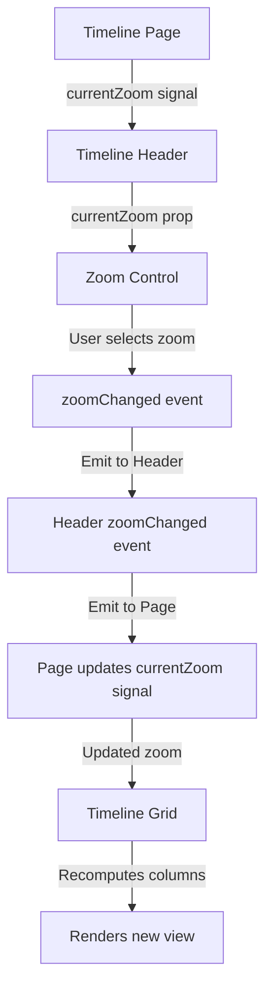

# Phase 3: Zoom Levels Implementation Prompt

## Context

We need to implement the **Zoom Level Control** that allows users to switch between three different timeline views: Day, Week, and Month. This is Phase 3 of the project, building on the completed TimelineGrid component (Phase 2) which already supports all three zoom levels through its `zoomLevel` input signal.

**Component to Create:** `ZoomControlComponent` (molecule)

**Location:** `src/app/features/timeline/components/molecules/zoom-control/`

**Integration Point:** Timeline Header organism (`features/timeline/components/organisms/timeline-header/`)

**Purpose:** Provide a dropdown control for users to select and switch between Day, Week, and Month timeline views.

## Requirements

### Technical Standards

- ✅ Angular 21 standalone component (no NgModule)
- ✅ OnPush change detection strategy
- ✅ Signal-based inputs using `input()`
- ✅ Signal-based outputs using `output()`
- ✅ Dependency injection using `inject()`
- ✅ New control flow syntax (`@if`, `@for`, `@switch`)
- ✅ BEM naming convention for CSS classes
- ✅ TypeScript strict mode compliance (no `any` types)
- ✅ Atomic Design hierarchy (molecule level)

### Component Architecture

**ZoomControlComponent (Molecule):**

**Inputs:**

- `currentZoom` - Signal input for currently selected zoom level ('day' | 'week' | 'month')

**Outputs:**

- `zoomChanged` - Emits new zoom level when user selects different option

**Local State:**

- `isOpen` - Signal for dropdown open/closed state
- `zoomOptions` - Constant array of available zoom options

**Dropdown Options:**

```typescript
const ZOOM_OPTIONS = [
  { value: 'day' as ZoomLevel, label: 'Day', icon: 'calendar-day' },
  { value: 'week' as ZoomLevel, label: 'Week', icon: 'calendar-week' },
  { value: 'month' as ZoomLevel, label: 'Month', icon: 'calendar-month' },
];
```

### Visual Design

**Dropdown Button (Closed State):**

- Width: 140px
- Height: 36px
- Border: 1px solid #dee2e6
- Border-radius: 6px
- Background: #ffffff
- Padding: 8px 12px
- Display: Selected option label + down arrow icon
- Font size: 0.875rem (14px)
- Font weight: 500
- Color: #212529
- Cursor: pointer

**Dropdown Button (Hover State):**

- Border color: #adb5bd
- Background: #f8f9fa
- Transition: all 0.15s ease

**Dropdown Button (Open State):**

- Border color: #5659ff
- Box-shadow: 0 0 0 3px rgba(86, 89, 255, 0.1)

**Dropdown Menu:**

- Position: Absolute, below button
- Width: Same as button (140px)
- Background: #ffffff
- Border: 1px solid #dee2e6
- Border-radius: 6px
- Box-shadow: 0 4px 12px rgba(0, 0, 0, 0.1)
- Margin-top: 4px
- z-index: 100

**Dropdown Options:**

- Padding: 10px 12px
- Font size: 0.875rem (14px)
- Color: #212529
- Cursor: pointer
- Transition: background 0.15s ease

**Dropdown Option (Hover):**

- Background: #f1f3f5

**Dropdown Option (Selected):**

- Background: #e7f5ff
- Color: #5659ff
- Font weight: 500

**Icon:**

- Size: 16x16px
- Color: #6c757d (inactive), #5659ff (selected)
- Position: Left of label, 8px margin-right

**Arrow Icon:**

- Size: 12x12px
- Color: #6c757d
- Position: Right side of button
- Transform: rotate(180deg) when open
- Transition: transform 0.2s ease

### Behavior Specifications

1. **Click to Toggle**
   - Click button to open dropdown
   - Click button again to close
   - Click outside to close (requires click outside directive or listener)

2. **Select Option**
   - Click option to select
   - Emit `zoomChanged` event with new zoom level
   - Close dropdown
   - Update button to show selected option

3. **Visual Feedback**
   - Current selection highlighted in dropdown
   - Hover states on all interactive elements
   - Smooth transitions for open/close

4. **Keyboard Support (Optional - Nice to have)**
   - Enter/Space to open dropdown
   - Arrow keys to navigate options
   - Enter/Space to select
   - Escape to close

## Design Reference

**Primary Design File:**

- `brief/design/Work Order Schedule - View Selection.jpg` - Shows zoom dropdown in open state

**Key Measurements to Extract:**

- Button width: ~140px
- Button height: 36px
- Border radius: 6px
- Padding: 8px 12px (button), 10px 12px (options)
- Spacing: 4px gap between button and dropdown
- Icon size: 16x16px (option icons), 12x12px (arrow)
- Font size: 0.875rem (14px)

**Colors to Match:**

- Primary: #5659ff
- Border: #dee2e6
- Border hover: #adb5bd
- Background: #ffffff
- Background hover: #f8f9fa
- Option hover: #f1f3f5
- Selected background: #e7f5ff
- Text: #212529
- Icon: #6c757d
- Shadow: rgba(0, 0, 0, 0.1)
- Focus ring: rgba(86, 89, 255, 0.1)

## Implementation Strategy

### Stage 1: Component Structure

**Goal:** Set up ZoomControl component files with basic structure

**Tasks:**

1. Create component files:
   - `zoom-control.ts`
   - `zoom-control.html`
   - `zoom-control.scss`

2. Set up component class:

```typescript
@Component({
  selector: 'app-zoom-control',
  standalone: true,
  changeDetection: ChangeDetectionStrategy.OnPush,
  imports: [CommonModule],
  templateUrl: './zoom-control.html',
  styleUrls: ['./zoom-control.scss'],
})
export class ZoomControlComponent {
  // Signal inputs
  currentZoom = input.required<ZoomLevel>();

  // Signal outputs
  zoomChanged = output<ZoomLevel>();

  // Local state
  isOpen = signal(false);

  // Zoom options constant
  readonly zoomOptions = [
    { value: 'day' as ZoomLevel, label: 'Day' },
    { value: 'week' as ZoomLevel, label: 'Week' },
    { value: 'month' as ZoomLevel, label: 'Month' },
  ];

  // Methods
  toggleDropdown() {
    this.isOpen.update(open => !open);
  }

  selectZoom(zoom: ZoomLevel) {
    this.zoomChanged.emit(zoom);
    this.isOpen.set(false);
  }

  // Computed signal for current label
  currentLabel = computed(() => {
    const option = this.zoomOptions.find(opt => opt.value === this.currentZoom());
    return option?.label || 'Day';
  });
}
```

**Verification:** Component compiles without errors

---

### Stage 2: Template Structure

**Goal:** Create HTML structure for dropdown

**Template Structure:**

```html
<div class="zoom-control">
  <!-- Dropdown Button -->
  <button
    class="zoom-control__button"
    [class.zoom-control__button--open]="isOpen()"
    (click)="toggleDropdown()"
    type="button"
  >
    <span class="zoom-control__label">{{ currentLabel() }}</span>
    <span class="zoom-control__arrow" [class.zoom-control__arrow--open]="isOpen()"> ▼ </span>
  </button>

  <!-- Dropdown Menu -->
  @if (isOpen()) {
  <div class="zoom-control__menu">
    @for (option of zoomOptions; track option.value) {
    <button
      class="zoom-control__option"
      [class.zoom-control__option--selected]="option.value === currentZoom()"
      (click)="selectZoom(option.value)"
      type="button"
    >
      {{ option.label }}
    </button>
    }
  </div>
  }
</div>
```

**Verification:** Template renders with button and dropdown (when open)

---

### Stage 3: Base Styling

**Goal:** Implement button styling (closed state)

**SCSS Structure:**

```scss
.zoom-control {
  position: relative;
  display: inline-block;

  &__button {
    display: flex;
    align-items: center;
    justify-content: space-between;
    width: 140px;
    height: 36px;
    padding: 8px 12px;
    background: #ffffff;
    border: 1px solid #dee2e6;
    border-radius: 6px;
    font-size: 0.875rem;
    font-weight: 500;
    color: #212529;
    cursor: pointer;
    transition: all 0.15s ease;

    &:hover {
      border-color: #adb5bd;
      background: #f8f9fa;
    }

    &--open {
      border-color: #5659ff;
      box-shadow: 0 0 0 3px rgba(86, 89, 255, 0.1);
    }
  }

  &__label {
    flex: 1;
  }

  &__arrow {
    font-size: 0.75rem;
    color: #6c757d;
    transition: transform 0.2s ease;

    &--open {
      transform: rotate(180deg);
    }
  }
}
```

**Verification:** Button looks correct, hover states work

---

### Stage 4: Dropdown Menu Styling

**Goal:** Style the dropdown menu and options

**SCSS Addition:**

```scss
.zoom-control {
  // ... previous styles ...

  &__menu {
    position: absolute;
    top: calc(100% + 4px);
    left: 0;
    width: 100%;
    background: #ffffff;
    border: 1px solid #dee2e6;
    border-radius: 6px;
    box-shadow: 0 4px 12px rgba(0, 0, 0, 0.1);
    z-index: 100;
    overflow: hidden;
  }

  &__option {
    display: block;
    width: 100%;
    padding: 10px 12px;
    background: none;
    border: none;
    font-size: 0.875rem;
    color: #212529;
    text-align: left;
    cursor: pointer;
    transition: background 0.15s ease;

    &:hover {
      background: #f1f3f5;
    }

    &--selected {
      background: #e7f5ff;
      color: #5659ff;
      font-weight: 500;
    }
  }
}
```

**Verification:** Dropdown menu appears below button, options styled correctly

---

### Stage 5: Click Outside Handler

**Goal:** Close dropdown when clicking outside

**Implementation Options:**

**Option A: HostListener (Simple)**

```typescript
@HostListener('document:click', ['$event'])
onClickOutside(event: MouseEvent) {
  const clickedInside = this.elementRef.nativeElement.contains(event.target);
  if (!this.isOpen() || clickedInside) return;
  this.isOpen.set(false);
}

// In constructor
private elementRef = inject(ElementRef);
```

**Option B: Effect (Signal-based)**

```typescript
constructor() {
  // Close dropdown on outside click
  effect(() => {
    if (!this.isOpen()) return;

    const handleClick = (event: MouseEvent) => {
      const target = event.target as Node;
      if (!this.elementRef.nativeElement.contains(target)) {
        this.isOpen.set(false);
      }
    };

    setTimeout(() => {
      document.addEventListener('click', handleClick);
    }, 0);

    return () => document.removeEventListener('click', handleClick);
  });
}
```

**Recommendation:** Use Option A (HostListener) for simplicity

**Verification:** Click outside closes dropdown

---

### Stage 6: Integration with Timeline Header

**Goal:** Add ZoomControl to TimelineHeader component

**Update TimelineHeader:**

```typescript
// timeline-header.ts
import { ZoomControlComponent } from '../molecules/zoom-control/zoom-control';

@Component({
  selector: 'app-timeline-header',
  standalone: true,
  imports: [CommonModule, ZoomControlComponent],
  // ...
})
export class TimelineHeaderComponent {
  // Add zoom level signal and output
  currentZoom = input.required<ZoomLevel>();
  zoomChanged = output<ZoomLevel>();

  onZoomChanged(zoom: ZoomLevel) {
    this.zoomChanged.emit(zoom);
  }
}
```

```html
<!-- timeline-header.html -->
<header class="timeline-header">
  <div class="timeline-header__left">
    <h1 class="timeline-header__title">Work Order Schedule</h1>
  </div>
  <div class="timeline-header__right">
    <app-zoom-control [currentZoom]="currentZoom()" (zoomChanged)="onZoomChanged($event)" />
  </div>
</header>
```

**Verification:** Zoom control appears in header, positioned correctly

---

### Stage 7: Integration with Timeline Page

**Goal:** Connect zoom control to TimelineGrid via Timeline page

**Update Timeline Page:**

```typescript
// timeline.ts
export class TimelineComponent {
  // Services
  private workCenterService = inject(WorkCenterService);
  private workOrderService = inject(WorkOrderService);

  // Signals
  workCenters = this.workCenterService.workCenters;
  workOrders = this.workOrderService.workOrders;
  currentZoom = signal<ZoomLevel>('day'); // Default to Day view

  // Methods
  onZoomChanged(zoom: ZoomLevel) {
    this.currentZoom.set(zoom);
  }
}
```

```html
<!-- timeline.html -->
<div class="timeline">
  <app-timeline-header [currentZoom]="currentZoom()" (zoomChanged)="onZoomChanged($event)" />

  <app-timeline-grid
    [workCenters]="workCenters()"
    [workOrders]="workOrders()"
    [zoomLevel]="currentZoom()"
  />
</div>
```

**Verification:** Selecting zoom level updates TimelineGrid view

---

### Stage 8: Animation Polish

**Goal:** Add smooth transitions for dropdown open/close

**SCSS Animation:**

```scss
.zoom-control {
  &__menu {
    animation: slideDown 0.2s ease;
  }
}

@keyframes slideDown {
  from {
    opacity: 0;
    transform: translateY(-8px);
  }
  to {
    opacity: 1;
    transform: translateY(0);
  }
}
```

**Verification:** Dropdown opens/closes smoothly

---

### Stage 9: Design Verification

**Goal:** Match design file pixel-perfect

**Check Against Design (`View Selection.jpg`):**

- [ ] Button width: 140px
- [ ] Button height: 36px
- [ ] Border color: #dee2e6
- [ ] Border radius: 6px
- [ ] Font size: 0.875rem (14px)
- [ ] Font weight: 500
- [ ] Padding: 8px 12px (button), 10px 12px (options)
- [ ] Arrow icon size and color
- [ ] Dropdown shadow: 0 4px 12px rgba(0, 0, 0, 0.1)
- [ ] Selected state: #e7f5ff background, #5659ff text
- [ ] Hover states match design
- [ ] Focus state with ring: rgba(86, 89, 255, 0.1)
- [ ] Spacing and positioning in header

**Tools:**

- Browser dev tools for measurement
- Color picker for color verification
- Side-by-side comparison with design file

**Verification:** Side-by-side comparison shows pixel-perfect match

---

### Stage 10: Accessibility & Edge Cases

**Goal:** Ensure component is accessible and handles edge cases

**Accessibility:**

- [ ] Add `aria-label` to button
- [ ] Add `aria-expanded` to button
- [ ] Add `role="menu"` to dropdown
- [ ] Add `role="menuitem"` to options
- [ ] Add `aria-selected` to current option

**Edge Cases:**

- [ ] Rapid clicking doesn't cause issues
- [ ] Works with all three zoom levels
- [ ] Dropdown closes on option select
- [ ] Z-index correct (above timeline content)
- [ ] Mobile responsiveness (if needed)

**Example Accessibility:**

```html
<button
  class="zoom-control__button"
  [attr.aria-expanded]="isOpen()"
  aria-label="Select timeline zoom level"
  (click)="toggleDropdown()"
>
  <!-- ... -->
</button>

<div class="zoom-control__menu" role="menu">
  @for (option of zoomOptions; track option.value) {
  <button
    role="menuitem"
    [attr.aria-selected]="option.value === currentZoom()"
    (click)="selectZoom(option.value)"
  >
    {{ option.label }}
  </button>
  }
</div>
```

**Verification:** Screen reader announces correctly, keyboard navigation works

---

## Data Flow



## Testing Checklist

**Functionality:**

- [ ] Component renders without errors
- [ ] Dropdown opens on button click
- [ ] Dropdown closes on button click (toggle)
- [ ] Dropdown closes when clicking outside
- [ ] Dropdown closes when selecting option
- [ ] Selecting "Day" emits 'day' zoom level
- [ ] Selecting "Week" emits 'week' zoom level
- [ ] Selecting "Month" emits 'month' zoom level
- [ ] Timeline Grid updates when zoom changes
- [ ] Current selection highlighted in dropdown
- [ ] Button shows current selection label

**Design Accuracy:**

- [ ] Button dimensions: 140px × 36px
- [ ] Border color and radius match
- [ ] Font size and weight correct
- [ ] Padding matches design
- [ ] Arrow icon size and rotation
- [ ] Dropdown shadow matches
- [ ] Hover states match
- [ ] Selected state colors match (#e7f5ff, #5659ff)
- [ ] Transitions smooth (0.15s - 0.2s)
- [ ] Positioned correctly in header

**Code Quality:**

- [ ] TypeScript strict mode passes
- [ ] OnPush change detection working
- [ ] All signals properly typed
- [ ] BEM naming consistent
- [ ] No console errors or warnings
- [ ] Component follows Atomic Design (molecule level)
- [ ] Accessibility attributes present

**Integration:**

- [ ] TimelineHeader receives and passes zoom signal
- [ ] Timeline page manages zoom state
- [ ] TimelineGrid responds to zoom changes
- [ ] All three views work (Day, Week, Month)
- [ ] No timing issues or race conditions

## Definition of Done

- [x] ZoomControl component created with all files
- [x] Dropdown button styled (closed, hover, open states)
- [x] Dropdown menu styled with options
- [x] Click outside handler implemented
- [x] Component integrated into TimelineHeader
- [x] TimelineHeader integrated into Timeline page
- [x] Zoom signal flows from control → header → page → grid
- [x] All three zoom levels work correctly
- [x] Animations and transitions smooth
- [x] Design matches pixel-perfect (compared with View Selection.jpg)
- [x] TypeScript strict mode passes (no errors)
- [x] OnPush change detection working correctly
- [x] All signals properly typed
- [x] BEM naming used consistently
- [x] Accessibility attributes added
- [x] No console errors or warnings
- [x] Memory bank updated (progress.md, activeContext.md)

## After Completion

**Update Memory Bank:**

```markdown
**Recent Changes:**

- ZoomControl molecule component implemented
- Dropdown behavior with click-outside handling
- Integration with TimelineHeader and Timeline page
- Signal-based zoom level management
- All three zoom views working (Day, Week, Month)

**Files to Update:**

- progress.md: Mark Phase 3 as complete
- activeContext.md: Document zoom control patterns, move focus to Phase 4
- systemPatterns.md: Add dropdown component pattern, signal flow for user controls

**New Patterns Discovered:**

- Click-outside handling with HostListener
- Dropdown animation techniques
- Signal flow for UI controls (component → organism → page → feature)
- State management for dropdown open/closed
```

## Common Issues & Solutions

### Issue 1: Dropdown Closes Immediately After Opening

**Cause:** Click event bubbles to document listener
**Solution:** Use `setTimeout` in effect, or stop propagation in button click

### Issue 2: Z-index Not Working

**Cause:** Parent container has `overflow: hidden`
**Solution:** Ensure timeline-header has `overflow: visible` or adjust z-index values

### Issue 3: Click Outside Not Working

**Cause:** Event listener timing issue
**Solution:** Add small setTimeout before attaching document listener

### Issue 4: TimelineGrid Not Updating

**Cause:** Signal not triggering recomputation
**Solution:** Ensure `zoomLevel` input is properly passed and grid computed signals depend on it

## Notes

- **Keep it simple** - This is a molecule component, not an organism
- **Reusable pattern** - This dropdown pattern can be reused for other controls
- **Already working** - TimelineGrid already supports all zoom levels, we're just adding the UI control
- **Test thoroughly** - Make sure all three views work correctly
- **Pixel-perfect** - The design file shows exact measurements

## Quick Command

```
I need to implement Phase 3: Zoom Level Control.

Follow the prompt in prompts/phase-3-zoom-levels.md
Work through stages 1-10 sequentially.
After each stage, verify it works before continuing.
Test all three zoom levels (Day, Week, Month) work correctly.
When complete, update memory bank with new patterns discovered.
```

## Bonus: Keyboard Navigation (Optional)

If time permits, add keyboard support:

```typescript
@HostListener('keydown', ['$event'])
onKeyDown(event: KeyboardEvent) {
  if (!this.isOpen()) {
    if (event.key === 'Enter' || event.key === ' ') {
      this.toggleDropdown();
      event.preventDefault();
    }
    return;
  }

  switch (event.key) {
    case 'Escape':
      this.isOpen.set(false);
      break;
    case 'ArrowDown':
    case 'ArrowUp':
      // Navigate options
      event.preventDefault();
      break;
    case 'Enter':
    case ' ':
      // Select current option
      event.preventDefault();
      break;
  }
}
```

This enhances accessibility but is not required for MVP.
