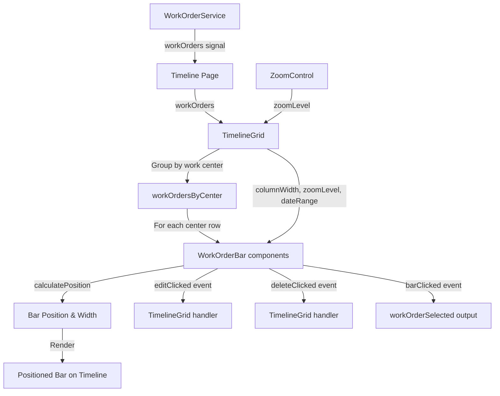

# Phase 4: Work Order Bars Implementation Prompt

## Context

We need to implement **Work Order Bars** that display work orders on the timeline grid. This includes bar positioning calculations, rendering work order names, status badges, and three-dot action menus. This is Phase 4 of the project, building on the completed TimelineGrid (Phase 2) and ZoomControl (Phase 3).

**Components to Create:**

1. **WorkOrderBarComponent** (molecule) - The individual work order bar
2. **StatusBadgeComponent** (atom) - The status indicator badge

**Location:**

- `src/app/features/timeline/components/molecules/work-order-bar/`
- `src/app/shared/components/atoms/status-badge/` (reusable atom)

**Integration Point:** TimelineGrid organism (renders bars in timeline rows)

**Purpose:** Visualize work orders on the timeline with proper positioning, status indication, and interaction controls.

## Requirements

### Technical Standards

- ✅ Angular 21 standalone components (no NgModule)
- ✅ OnPush change detection strategy
- ✅ Signal-based inputs using `input()`
- ✅ Signal-based outputs using `output()`
- ✅ Dependency injection using `inject()`
- ✅ New control flow syntax (`@if`, `@for`, `@switch`)
- ✅ BEM naming convention for CSS classes
- ✅ TypeScript strict mode compliance (no `any` types)
- ✅ Atomic Design hierarchy (molecule for bar, atom for badge)

### Component Architecture

#### StatusBadgeComponent (Atom)

**Purpose:** Display status indicator with color coding

**Inputs:**

- `status` - Signal input of work order status ('open' | 'in-progress' | 'complete' | 'blocked')

**Visual Specs:**

- Pill-shaped badge (border-radius: 12px)
- Padding: 4px 8px
- Font size: 0.75rem (12px)
- Font weight: 500
- Text transform: capitalize

**Status Colors:**

```typescript
const STATUS_STYLES = {
  open: {
    background: '#e7f5ff',
    color: '#1971c2',
    label: 'Open',
  },
  'in-progress': {
    background: '#f3e5f5',
    color: '#7b1fa2',
    label: 'In Progress',
  },
  complete: {
    background: '#d4edda',
    color: '#155724',
    label: 'Complete',
  },
  blocked: {
    background: '#fff3cd',
    color: '#856404',
    label: 'Blocked',
  },
};
```

#### WorkOrderBarComponent (Molecule)

**Purpose:** Display work order bar with name, status badge, and actions menu

**Inputs:**

- `workOrder` - Signal input of work order data
- `columnWidth` - Signal input for current zoom level column width
- `zoomLevel` - Signal input for current zoom level
- `dateRangeStart` - Signal input for timeline start date (for positioning)

**Outputs:**

- `editClicked` - Emits work order when edit is clicked
- `deleteClicked` - Emits work order when delete is clicked
- `barClicked` - Emits work order when bar itself is clicked

**Local State:**

- `isHovered` - Signal for hover state
- `isMenuOpen` - Signal for three-dot menu open/closed state

**Computed Signals:**

- `barPosition` - Computed position (left offset in pixels)
- `barWidth` - Computed width based on date range and zoom level

### Visual Design

#### Work Order Bar (Default State)

**Layout:**

- Position: Absolute within timeline row
- Height: 36px
- Border-radius: 6px
- Padding: 8px 12px
- Display: Flex (align items center)
- Gap: 8px between elements
- Cursor: pointer

**Colors by Status:**

- Open: Background #5659ff, Border 1px solid #4c51bf
- In Progress: Background #6f42c1, Border 1px solid #5a34a1
- Complete: Background #28a745, Border 1px solid #218838
- Blocked: Background #ffc107, Border 1px solid #e0a800

**Text:**

- Work order name (truncate with ellipsis if too long)
- Font size: 0.875rem (14px)
- Font weight: 500
- Color: #ffffff
- Line height: 1.2

**Status Badge:**

- Positioned after work order name
- Uses StatusBadgeComponent

#### Work Order Bar (Hover State)

**Changes:**

- Opacity: 0.9
- Box-shadow: 0 2px 8px rgba(0, 0, 0, 0.15)
- Three-dot menu button appears (right side)
- Transition: all 0.15s ease

**Three-Dot Button:**

- Position: Absolute right side (8px from edge)
- Size: 24x24px
- Background: rgba(255, 255, 255, 0.2)
- Border-radius: 4px
- Color: #ffffff
- Font size: 16px
- Cursor: pointer
- Hover: Background rgba(255, 255, 255, 0.3)

#### Three-Dot Menu (Dropdown)

**Menu Container:**

- Position: Absolute, below bar or above if near bottom
- Width: 120px
- Background: #ffffff
- Border: 1px solid #dee2e6
- Border-radius: 6px
- Box-shadow: 0 4px 12px rgba(0, 0, 0, 0.15)
- z-index: 1000
- Margin-top: 4px

**Menu Options:**

- Edit option: "Edit" text, icon (pencil)
- Delete option: "Delete" text, icon (trash)
- Padding: 10px 12px per option
- Font size: 0.875rem (14px)
- Color: #212529 (Edit), #dc3545 (Delete)
- Cursor: pointer
- Hover: Background #f1f3f5
- Border between options: 1px solid #e9ecef

### Positioning Algorithm

**Calculate Bar Position:**

```typescript
function calculateBarPosition(
  workOrder: WorkOrderDocument,
  dateRangeStart: Date,
  columnWidth: number,
  zoomLevel: ZoomLevel
): { left: number; width: number } {
  const startDate = new Date(workOrder.data.startDate);
  const endDate = new Date(workOrder.data.endDate);

  // Calculate days from timeline start
  const daysFromStart = differenceInDays(startDate, dateRangeStart);

  // Calculate duration in days
  const durationDays = differenceInDays(endDate, startDate);

  // Calculate pixel positions based on zoom level
  let left: number;
  let width: number;

  switch (zoomLevel) {
    case 'day':
      // Each column = 1 day = 120px
      left = daysFromStart * columnWidth;
      width = durationDays * columnWidth;
      break;

    case 'week':
      // Each column = 1 week = 140px
      left = (daysFromStart / 7) * columnWidth;
      width = (durationDays / 7) * columnWidth;
      break;

    case 'month':
      // Each column = 1 month = 180px
      // More complex: need to calculate months between dates
      const monthsFromStart = calculateMonthsDifference(dateRangeStart, startDate);
      const monthsDuration = calculateMonthsDifference(startDate, endDate);
      left = monthsFromStart * columnWidth;
      width = monthsDuration * columnWidth;
      break;
  }

  // Add padding/margin if needed
  left += 4; // 4px padding from left edge
  width -= 8; // 4px padding on both sides

  return { left, width };
}
```

**Constraints:**

- Minimum width: 80px (to ensure text is readable)
- Maximum width: No limit (can span multiple columns)
- Bars stay within their work center row
- Bars don't overlap within same row (visual only, no collision detection yet)

## Design Reference

**Primary Design Files:**

- `brief/design/Work Order Schedule - Default.jpg` - Shows work order bars in default state
- `brief/design/Work Order Schedule - Options CTA Controls (shown on hover).jpg` - Shows hover state with three-dot menu
- `brief/design/Work Order Schedule - Edit and Delete Controls Expanded.jpg` - Shows expanded dropdown menu

**Key Measurements to Extract:**

- Bar height: 36px
- Bar border-radius: 6px
- Bar padding: 8px 12px
- Status badge padding: 4px 8px
- Status badge font size: 0.75rem (12px)
- Bar font size: 0.875rem (14px)
- Three-dot button size: 24x24px
- Dropdown width: 120px
- Dropdown option padding: 10px 12px

**Colors to Extract:**

- Open: #5659ff (background), #4c51bf (border)
- In Progress: #6f42c1 (background), #5a34a1 (border)
- Complete: #28a745 (background), #218838 (border)
- Blocked: #ffc107 (background), #e0a800 (border)
- Text on bars: #ffffff
- Dropdown background: #ffffff
- Dropdown border: #dee2e6
- Delete text: #dc3545

## Implementation Strategy

### Stage 1: StatusBadge Atom Component

**Goal:** Create reusable status badge component

**Tasks:**

1. Create component files:
   - `src/app/shared/components/atoms/status-badge/status-badge.ts`
   - `src/app/shared/components/atoms/status-badge/status-badge.html`
   - `src/app/shared/components/atoms/status-badge/status-badge.scss`

2. Implement component:

```typescript
@Component({
  selector: 'app-status-badge',
  standalone: true,
  changeDetection: ChangeDetectionStrategy.OnPush,
  imports: [CommonModule],
  templateUrl: './status-badge.html',
  styleUrls: ['./status-badge.scss'],
})
export class StatusBadgeComponent {
  status = input.required<WorkOrderStatus>();

  readonly statusConfig = {
    open: { background: '#e7f5ff', color: '#1971c2', label: 'Open' },
    'in-progress': { background: '#f3e5f5', color: '#7b1fa2', label: 'In Progress' },
    complete: { background: '#d4edda', color: '#155724', label: 'Complete' },
    blocked: { background: '#fff3cd', color: '#856404', label: 'Blocked' },
  };

  currentConfig = computed(() => this.statusConfig[this.status()]);
}
```

**Template:**

```html
<span
  class="status-badge"
  [style.background]="currentConfig().background"
  [style.color]="currentConfig().color"
>
  {{ currentConfig().label }}
</span>
```

**Styles:**

```scss
.status-badge {
  display: inline-block;
  padding: 4px 8px;
  border-radius: 12px;
  font-size: 0.75rem;
  font-weight: 500;
  white-space: nowrap;
}
```

**Verification:** Status badge renders correctly for all four status types

---

### Stage 2: WorkOrderBar Component Structure

**Goal:** Set up WorkOrderBar component files with basic structure

**Tasks:**

1. Create component files:
   - `src/app/features/timeline/components/molecules/work-order-bar/work-order-bar.ts`
   - `src/app/features/timeline/components/molecules/work-order-bar/work-order-bar.html`
   - `src/app/features/timeline/components/molecules/work-order-bar/work-order-bar.scss`

2. Set up component class:

```typescript
@Component({
  selector: 'app-work-order-bar',
  standalone: true,
  changeDetection: ChangeDetectionStrategy.OnPush,
  imports: [CommonModule, StatusBadgeComponent],
  templateUrl: './work-order-bar.html',
  styleUrls: ['./work-order-bar.scss'],
})
export class WorkOrderBarComponent {
  // Signal inputs
  workOrder = input.required<WorkOrderDocument>();
  columnWidth = input.required<number>();
  zoomLevel = input.required<ZoomLevel>();
  dateRangeStart = input.required<Date>();

  // Signal outputs
  editClicked = output<WorkOrderDocument>();
  deleteClicked = output<WorkOrderDocument>();
  barClicked = output<WorkOrderDocument>();

  // Local state
  isHovered = signal(false);
  isMenuOpen = signal(false);

  // Computed signals
  barPosition = computed(() => {
    return this.calculatePosition();
  });

  barStyles = computed(() => {
    const status = this.workOrder().data.status;
    return this.getStatusStyles(status);
  });

  // Methods
  private calculatePosition(): { left: number; width: number } {
    // Implementation from positioning algorithm
    return { left: 0, width: 100 };
  }

  private getStatusStyles(status: WorkOrderStatus) {
    const styles = {
      open: { background: '#5659ff', border: '1px solid #4c51bf' },
      'in-progress': { background: '#6f42c1', border: '1px solid #5a34a1' },
      complete: { background: '#28a745', border: '1px solid #218838' },
      blocked: { background: '#ffc107', border: '1px solid #e0a800' },
    };
    return styles[status];
  }

  toggleMenu() {
    this.isMenuOpen.update(open => !open);
  }

  onEdit() {
    this.editClicked.emit(this.workOrder());
    this.isMenuOpen.set(false);
  }

  onDelete() {
    this.deleteClicked.emit(this.workOrder());
    this.isMenuOpen.set(false);
  }

  onBarClick(event: MouseEvent) {
    // Only emit if not clicking menu button
    if (!(event.target as HTMLElement).closest('.work-order-bar__menu-button')) {
      this.barClicked.emit(this.workOrder());
    }
  }
}
```

**Verification:** Component compiles without errors

---

### Stage 3: Bar Positioning Logic

**Goal:** Implement the position calculation algorithm

**Implementation:**

```typescript
private calculatePosition(): { left: number; width: number } {
  const workOrder = this.workOrder();
  const startDate = new Date(workOrder.data.startDate);
  const endDate = new Date(workOrder.data.endDate);
  const dateRangeStart = this.dateRangeStart();
  const columnWidth = this.columnWidth();
  const zoomLevel = this.zoomLevel();

  const daysFromStart = differenceInDays(startDate, dateRangeStart);
  const durationDays = differenceInDays(endDate, startDate);

  let left: number;
  let width: number;

  switch (zoomLevel) {
    case 'day':
      left = daysFromStart * columnWidth;
      width = durationDays * columnWidth;
      break;
    case 'week':
      left = (daysFromStart / 7) * columnWidth;
      width = (durationDays / 7) * columnWidth;
      break;
    case 'month':
      const monthsFromStart = this.calculateMonthsDifference(dateRangeStart, startDate);
      const monthsDuration = this.calculateMonthsDifference(startDate, endDate);
      left = monthsFromStart * columnWidth;
      width = monthsDuration * columnWidth;
      break;
  }

  // Add padding and enforce minimum width
  left += 4;
  width = Math.max(width - 8, 80); // Minimum 80px width

  return { left, width };
}

private calculateMonthsDifference(start: Date, end: Date): number {
  const yearsDiff = end.getFullYear() - start.getFullYear();
  const monthsDiff = end.getMonth() - start.getMonth();
  const daysDiff = end.getDate() - start.getDate();

  let totalMonths = yearsDiff * 12 + monthsDiff;

  // Add fractional month based on days
  if (daysDiff > 0) {
    const daysInMonth = new Date(end.getFullYear(), end.getMonth() + 1, 0).getDate();
    totalMonths += daysDiff / daysInMonth;
  }

  return totalMonths;
}
```

**Add date utility imports:**

```typescript
import { differenceInDays } from '@/app/core/utils/date.utils';
```

**Verification:** Log calculated positions, verify they make sense for sample data

---

### Stage 4: Bar Template Structure

**Goal:** Create HTML structure for work order bar

**Template:**

```html
<div
  class="work-order-bar"
  [class.work-order-bar--hovered]="isHovered()"
  [style.left.px]="barPosition().left"
  [style.width.px]="barPosition().width"
  [style.background]="barStyles().background"
  [style.border]="barStyles().border"
  (mouseenter)="isHovered.set(true)"
  (mouseleave)="isHovered.set(false)"
  (click)="onBarClick($event)"
>
  <span class="work-order-bar__name">{{ workOrder().data.name }}</span>

  <app-status-badge [status]="workOrder().data.status" />

  @if (isHovered()) {
  <button
    class="work-order-bar__menu-button"
    (click)="toggleMenu(); $event.stopPropagation()"
    type="button"
  >
    ⋮
  </button>
  } @if (isMenuOpen()) {
  <div class="work-order-bar__menu" (click)="$event.stopPropagation()">
    <button
      class="work-order-bar__menu-option work-order-bar__menu-option--edit"
      (click)="onEdit()"
      type="button"
    >
      <span class="work-order-bar__menu-icon">✏️</span>
      <span>Edit</span>
    </button>
    <button
      class="work-order-bar__menu-option work-order-bar__menu-option--delete"
      (click)="onDelete()"
      type="button"
    >
      <span class="work-order-bar__menu-icon">🗑️</span>
      <span>Delete</span>
    </button>
  </div>
  }
</div>
```

**Verification:** Template renders with work order data

---

### Stage 5: Bar Base Styling

**Goal:** Style the work order bar (default state)

**SCSS:**

```scss
.work-order-bar {
  position: absolute;
  height: 36px;
  border-radius: 6px;
  padding: 8px 12px;
  display: flex;
  align-items: center;
  gap: 8px;
  cursor: pointer;
  transition: all 0.15s ease;
  z-index: 1;

  &__name {
    flex: 1;
    font-size: 0.875rem;
    font-weight: 500;
    color: #ffffff;
    white-space: nowrap;
    overflow: hidden;
    text-overflow: ellipsis;
    line-height: 1.2;
  }

  &--hovered {
    opacity: 0.9;
    box-shadow: 0 2px 8px rgba(0, 0, 0, 0.15);
    z-index: 10;
  }
}
```

**Verification:** Bars display with correct colors, padding, and text

---

### Stage 6: Three-Dot Menu Styling

**Goal:** Style the menu button and dropdown

**SCSS Addition:**

```scss
.work-order-bar {
  // ... previous styles ...

  &__menu-button {
    position: absolute;
    right: 8px;
    width: 24px;
    height: 24px;
    background: rgba(255, 255, 255, 0.2);
    border: none;
    border-radius: 4px;
    color: #ffffff;
    font-size: 16px;
    line-height: 1;
    cursor: pointer;
    transition: background 0.15s ease;
    display: flex;
    align-items: center;
    justify-content: center;

    &:hover {
      background: rgba(255, 255, 255, 0.3);
    }
  }

  &__menu {
    position: absolute;
    top: calc(100% + 4px);
    right: 0;
    width: 120px;
    background: #ffffff;
    border: 1px solid #dee2e6;
    border-radius: 6px;
    box-shadow: 0 4px 12px rgba(0, 0, 0, 0.15);
    z-index: 1000;
    overflow: hidden;
  }

  &__menu-option {
    display: flex;
    align-items: center;
    gap: 8px;
    width: 100%;
    padding: 10px 12px;
    background: none;
    border: none;
    border-bottom: 1px solid #e9ecef;
    font-size: 0.875rem;
    color: #212529;
    text-align: left;
    cursor: pointer;
    transition: background 0.15s ease;

    &:last-child {
      border-bottom: none;
    }

    &:hover {
      background: #f1f3f5;
    }

    &--delete {
      color: #dc3545;
    }
  }

  &__menu-icon {
    font-size: 1rem;
  }
}
```

**Verification:** Menu button appears on hover, dropdown styled correctly

---

### Stage 7: Integration with TimelineGrid

**Goal:** Render work order bars in the timeline grid

**Update TimelineGrid:**

```typescript
// timeline-grid.ts
import { WorkOrderBarComponent } from '../molecules/work-order-bar/work-order-bar';

@Component({
  selector: 'app-timeline-grid',
  imports: [CommonModule, WorkOrderBarComponent],
  // ...
})
export class TimelineGridComponent {
  // ... existing code ...

  // Computed signal for bars grouped by work center
  workOrdersByCenter = computed(() => {
    const orders = this.workOrders();
    const centers = this.workCenters();

    // Group orders by work center
    const grouped = new Map<string, WorkOrderDocument[]>();

    centers.forEach(center => {
      grouped.set(center.docId, []);
    });

    orders.forEach(order => {
      const centerId = order.data.workCenterId;
      const list = grouped.get(centerId);
      if (list) {
        list.push(order);
      }
    });

    return grouped;
  });

  // Method to get orders for specific work center
  getOrdersForCenter(centerId: string): WorkOrderDocument[] {
    return this.workOrdersByCenter().get(centerId) || [];
  }

  // Handle bar events
  onWorkOrderEdit(workOrder: WorkOrderDocument) {
    // TODO: Open edit panel (Phase 5)
    console.log('Edit work order:', workOrder);
  }

  onWorkOrderDelete(workOrder: WorkOrderDocument) {
    // TODO: Implement delete (Phase 6)
    console.log('Delete work order:', workOrder);
  }

  onWorkOrderClick(workOrder: WorkOrderDocument) {
    this.workOrderSelected.emit(workOrder);
  }
}
```

**Update TimelineGrid Template:**

```html
<!-- In the row section, add bars -->
@for (center of workCenters(); track center.docId) {
<div class="timeline-grid__row">
  <div class="timeline-grid__work-center">{{ center.data.name }}</div>

  <div class="timeline-grid__timeline-row">
    <!-- Date columns render here -->

    <!-- Work order bars for this row -->
    <div class="timeline-grid__bars-container">
      @for (order of getOrdersForCenter(center.docId); track order.docId) {
      <app-work-order-bar
        [workOrder]="order"
        [columnWidth]="columnWidth()"
        [zoomLevel]="zoomLevel()"
        [dateRangeStart]="dateRange().start"
        (editClicked)="onWorkOrderEdit($event)"
        (deleteClicked)="onWorkOrderDelete($event)"
        (barClicked)="onWorkOrderClick($event)"
      />
      }
    </div>
  </div>
</div>
}
```

**Update TimelineGrid SCSS:**

```scss
.timeline-grid {
  // ... existing styles ...

  &__bars-container {
    position: relative;
    height: 100%;
    pointer-events: none; // Allow click-through to timeline

    // Re-enable pointer events on bars
    app-work-order-bar {
      pointer-events: auto;
    }
  }

  &__timeline-row {
    position: relative;
    // Ensure bars container doesn't interfere with grid
  }
}
```

**Verification:** Bars render on timeline at correct positions

---

### Stage 8: Click Outside Menu Handler

**Goal:** Close menu when clicking outside

**Implementation:**

```typescript
@HostListener('document:click', ['$event'])
onClickOutside(event: MouseEvent) {
  if (!this.isMenuOpen()) return;

  const clickedInside = this.elementRef.nativeElement.contains(event.target);
  if (!clickedInside) {
    this.isMenuOpen.set(false);
  }
}

// In constructor
private elementRef = inject(ElementRef);
```

**Verification:** Menu closes when clicking outside

---

### Stage 9: Design Verification

**Goal:** Match design files pixel-perfect

**Check Against Design Files:**

- [ ] Bar height: 36px
- [ ] Bar border-radius: 6px
- [ ] Bar padding: 8px 12px
- [ ] Status colors match exactly (Open, In Progress, Complete, Blocked)
- [ ] Status badge styling matches
- [ ] Font sizes match (0.875rem bar, 0.75rem badge)
- [ ] Three-dot button: 24x24px
- [ ] Three-dot hover background: rgba(255, 255, 255, 0.2)
- [ ] Dropdown width: 120px
- [ ] Dropdown shadow: 0 4px 12px rgba(0, 0, 0, 0.15)
- [ ] Edit/Delete colors match
- [ ] Hover states match (opacity 0.9, box-shadow)
- [ ] Transitions smooth (0.15s)

**Tools:**

- Browser dev tools for measurement
- Color picker for color verification
- Side-by-side comparison with design files

**Verification:** Side-by-side comparison shows pixel-perfect match

---

### Stage 10: Edge Cases & Polish

**Goal:** Handle edge cases and add final polish

**Edge Cases:**

- [ ] Very short work orders (< 1 day) - enforce minimum width
- [ ] Very long work orders (span multiple months) - ensure text readable
- [ ] Work order name too long - truncate with ellipsis
- [ ] Menu near right edge - ensure dropdown visible
- [ ] Menu near bottom - position above bar if needed
- [ ] Multiple bars on same row - ensure z-index correct on hover
- [ ] Rapid clicking doesn't cause issues

**Enhancements:**

- [ ] Add tooltip showing full name on hover (optional)
- [ ] Smooth menu open/close animation
- [ ] Keyboard support for menu (Escape to close)

**Example Menu Positioning Fix:**

```typescript
menuPosition = computed(() => {
  const barPosition = this.barPosition();
  const barRight = barPosition.left + barPosition.width;

  // If bar is near right edge, position menu to the left
  const viewportWidth = window.innerWidth;
  if (barRight > viewportWidth - 150) {
    return { right: '0', left: 'auto' };
  }

  return { right: '0', left: 'auto' };
});
```

**Verification:** All edge cases handled gracefully

---

## Data Flow



## Testing Checklist

**Functionality:**

- [ ] StatusBadge renders correctly for all four status types
- [ ] WorkOrderBar renders with correct data
- [ ] Bars positioned correctly at start dates
- [ ] Bar widths match duration correctly
- [ ] Bars update position when zoom level changes
- [ ] Hover state shows three-dot menu
- [ ] Click three-dot menu opens dropdown
- [ ] Edit option emits editClicked event
- [ ] Delete option emits deleteClicked event
- [ ] Click bar emits barClicked event
- [ ] Menu closes when clicking outside
- [ ] Menu closes after selecting option
- [ ] Multiple bars render on same row without overlap issues

**Design Accuracy:**

- [ ] Bar dimensions: 36px height, correct width
- [ ] Status colors exact match (all four types)
- [ ] Status badge styling matches design
- [ ] Font sizes correct (0.875rem, 0.75rem)
- [ ] Padding matches design
- [ ] Three-dot button: 24x24px, correct styling
- [ ] Dropdown width: 120px
- [ ] Dropdown shadow and border match
- [ ] Hover states match (opacity, shadow)
- [ ] Transitions smooth (0.15s)
- [ ] Delete option text color: #dc3545

**Code Quality:**

- [ ] TypeScript strict mode passes
- [ ] OnPush change detection working
- [ ] All signals properly typed
- [ ] BEM naming consistent
- [ ] No console errors or warnings
- [ ] Components follow Atomic Design
- [ ] Position calculation algorithm correct

**Integration:**

- [ ] Bars render in TimelineGrid rows
- [ ] Bars grouped by work center correctly
- [ ] Events bubble up correctly
- [ ] Works with all three zoom levels
- [ ] No performance issues with many bars (10+)

## Definition of Done

- [x] StatusBadgeComponent created and working
- [x] WorkOrderBarComponent created and working
- [x] Bar positioning algorithm implemented
- [x] Bars render at correct positions
- [x] Status color coding working
- [x] Status badge displays correctly
- [x] Three-dot menu on hover
- [x] Dropdown menu with Edit/Delete
- [x] Click outside closes menu
- [x] Events emit correctly (edit, delete, bar click)
- [x] Integration with TimelineGrid complete
- [x] Works with all zoom levels (Day, Week, Month)
- [x] Edge cases handled (long names, minimum width, etc.)
- [x] Design matches pixel-perfect (compared with design files)
- [x] TypeScript strict mode passes (no errors)
- [x] OnPush change detection working correctly
- [x] All signals properly typed
- [x] BEM naming used consistently
- [x] No console errors or warnings
- [x] Memory bank updated (progress.md, activeContext.md)

## After Completion

**Update Memory Bank:**

```markdown
**Recent Changes:**

- StatusBadgeComponent atom created (reusable)
- WorkOrderBarComponent molecule implemented
- Bar positioning algorithm for all zoom levels
- Three-dot menu with Edit/Delete actions
- Integration with TimelineGrid
- Work orders now visible on timeline

**Files to Update:**

- progress.md: Mark Phase 4 as complete
- activeContext.md: Document bar positioning patterns, move focus to Phase 5
- systemPatterns.md: Add positioning algorithm details, status color system

**New Patterns Discovered:**

- Date-based positioning calculations
- Zoom-level-aware width calculations
- Status color coding system
- Grouped data rendering (orders by work center)
- Event bubbling pattern (bar → grid → page)
```

## Common Issues & Solutions

### Issue 1: Bars Not Positioning Correctly

**Cause:** Date calculation error or timezone issues  
**Solution:** Ensure dates are in consistent format, use date.utils functions

### Issue 2: Bars Overlapping Text

**Cause:** Z-index issues  
**Solution:** Set bars container to lower z-index, individual bars higher on hover

### Issue 3: Menu Dropdown Cut Off

**Cause:** Parent overflow: hidden  
**Solution:** Ensure timeline-grid allows overflow, or use higher z-index

### Issue 4: Performance Issues with Many Bars

**Cause:** Too many re-renders  
**Solution:** Use OnPush, track by docId in @for loops, computed signals for grouping

### Issue 5: Click Events Not Working

**Cause:** Pointer-events or event bubbling  
**Solution:** Use stopPropagation on menu clicks, ensure pointer-events: auto on bars

## Notes

- **Position calculation is critical** - Test thoroughly with different date ranges
- **Status colors must be exact** - Use color picker to verify from design files
- **Minimum width enforcement** - Ensure bars are always readable
- **Performance matters** - Use computed signals, avoid unnecessary recalculations
- **Event handling** - Use stopPropagation to prevent unwanted bubbling
- **Future integration** - Phase 5 will use these events to open edit panel

## Quick Command

```
I need to implement Phase 4: Work Order Bars.

Follow the prompt in prompts/phase-4-work-order-bars.md
Work through stages 1-10 sequentially.
After each stage, verify it works before continuing.
Test positioning with all three zoom levels (Day, Week, Month).
Verify status colors match design files exactly.
When complete, update memory bank with new patterns discovered.
```

## Utility Functions Needed

**Add to `date.utils.ts` if not present:**

```typescript
/**
 * Calculate the difference in months between two dates
 * Returns fractional months (e.g., 1.5 for 1 month and 15 days)
 */
export function differenceInMonths(dateLeft: Date, dateRight: Date): number {
  const yearsDiff = dateLeft.getFullYear() - dateRight.getFullYear();
  const monthsDiff = dateLeft.getMonth() - dateRight.getMonth();
  const daysDiff = dateLeft.getDate() - dateRight.getDate();

  let totalMonths = yearsDiff * 12 + monthsDiff;

  // Add fractional month based on days
  if (daysDiff !== 0) {
    const daysInMonth = new Date(dateLeft.getFullYear(), dateLeft.getMonth() + 1, 0).getDate();
    totalMonths += daysDiff / daysInMonth;
  }

  return totalMonths;
}
```

This utility will help with Month zoom level positioning calculations.
