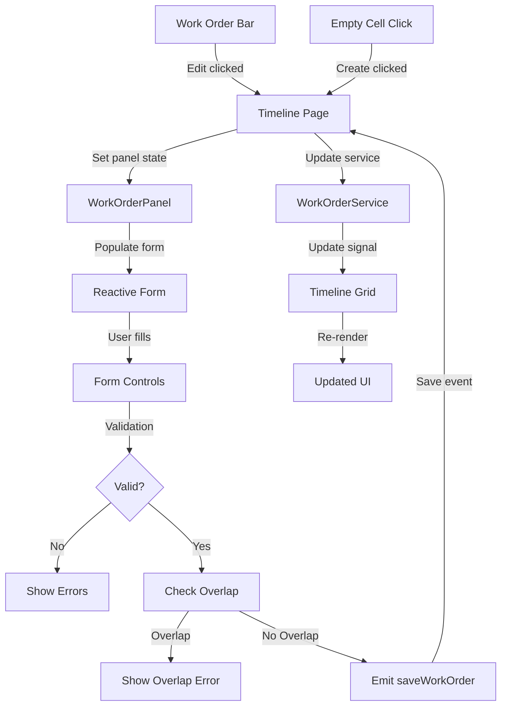

# Phase 5: Create/Edit Panel Implementation Prompt

## Context

We need to implement the **Work Order Panel** - a slide-out panel for creating and editing work orders. This panel includes a reactive form with name input, status dropdown, start/end date pickers, validation, and overlap detection. This is Phase 5 of the project, building on completed work order bars (Phase 4) that trigger edit actions.

**Component to Create:** `WorkOrderPanelComponent` (organism)

**Location:** `src/app/features/timeline/components/organisms/work-order-panel/`

**Integration Points:**

- Timeline page (manages panel open/closed state)
- Work order bars (trigger edit mode)
- Empty timeline cells (trigger create mode)

**Purpose:** Provide a user-friendly form interface for creating new work orders and editing existing ones, with validation and overlap detection.

## Requirements

### Technical Standards

- ✅ Angular 21 standalone component (no NgModule)
- ✅ OnPush change detection strategy
- ✅ Signal-based inputs using `input()`
- ✅ Signal-based outputs using `output()`
- ✅ Reactive Forms with FormGroup and FormControl
- ✅ Dependency injection using `inject()`
- ✅ New control flow syntax (`@if`, `@for`, `@switch`)
- ✅ BEM naming convention for CSS classes
- ✅ TypeScript strict mode compliance (no `any` types)
- ✅ Atomic Design hierarchy (organism level)
- ✅ **Use ng-bootstrap datepicker** for date selection
- ✅ **Use ng-select** for status dropdown

### Component Architecture

#### WorkOrderPanelComponent (Organism)

**Inputs:**

- `isOpen` - Signal input for panel open/closed state
- `mode` - Signal input for 'create' or 'edit' mode
- `workOrder` - Signal input for work order being edited (null in create mode)
- `prefilledData` - Signal input for prefilled data (work center, date) in create mode
- `workCenters` - Signal input for work center dropdown options
- `existingWorkOrders` - Signal input for overlap detection

**Outputs:**

- `closePanel` - Emits when panel should close
- `saveWorkOrder` - Emits new/updated work order data
- `deleteWorkOrder` - Emits work order to delete (edit mode only)

**Local State:**

- `form` - FormGroup with controls for name, status, workCenter, startDate, endDate
- `isSubmitting` - Signal for save in progress state
- `validationErrors` - Signal for custom validation errors (overlap detection)

**Reactive Form Structure:**

```typescript
form = new FormGroup({
  name: new FormControl('', [Validators.required, Validators.minLength(3)]),
  status: new FormControl<WorkOrderStatus>('open', Validators.required),
  workCenterId: new FormControl('', Validators.required),
  startDate: new FormControl('', Validators.required),
  endDate: new FormControl('', Validators.required),
});
```

### Visual Design

#### Panel Container

**Layout:**

- Position: Fixed right side
- Width: 400px
- Height: 100vh
- Transform: translateX(100%) when closed, translateX(0) when open
- Transition: transform 0.3s ease-in-out
- Background: #ffffff
- Box-shadow: -4px 0 12px rgba(0, 0, 0, 0.1)
- z-index: 1000

**Header:**

- Padding: 24px
- Border-bottom: 1px solid #e9ecef
- Title: "Create Work Order" or "Edit Work Order"
- Font size: 1.5rem (24px)
- Font weight: 600
- Close button: Top-right corner, 32x32px, icon "×"

**Content:**

- Padding: 24px
- Overflow-y: auto
- Max-height: calc(100vh - 160px) (header + footer)

**Footer:**

- Padding: 16px 24px
- Border-top: 1px solid #e9ecef
- Position: Sticky bottom
- Background: #ffffff
- Buttons: Save and Cancel (Create mode), Save, Delete, Cancel (Edit mode)

#### Form Fields

**Form Field Spacing:**

- Margin-bottom: 20px between fields
- Label margin-bottom: 8px

**Label:**

- Font size: 0.875rem (14px)
- Font weight: 500
- Color: #495057
- Margin-bottom: 8px
- Display: block

**Input (Text Field):**

- Height: 40px
- Padding: 8px 12px
- Border: 1px solid #ced4da
- Border-radius: 6px
- Font size: 0.875rem (14px)
- Color: #212529
- Background: #ffffff
- Transition: border-color 0.15s ease

**Input (Focus State):**

- Border-color: #5659ff
- Box-shadow: 0 0 0 3px rgba(86, 89, 255, 0.1)
- Outline: none

**Input (Error State):**

- Border-color: #dc3545
- Background: #fff5f5

**Error Message:**

- Font size: 0.75rem (12px)
- Color: #dc3545
- Margin-top: 4px
- Display: block

**Placeholder:**

- Color: #adb5bd
- Font-style: normal

#### Status Dropdown (ng-select)

**Using @ng-select/ng-select:**

```html
<ng-select
  [items]="statusOptions"
  bindLabel="label"
  bindValue="value"
  formControlName="status"
  placeholder="Select status"
  [clearable]="false"
  class="custom-ng-select"
>
</ng-select>
```

**Custom Styling:**

- Height: 40px
- Border: 1px solid #ced4da
- Border-radius: 6px
- Font size: 0.875rem (14px)
- Dropdown background: #ffffff
- Option hover: #f1f3f5
- Selected option: #e7f5ff with #5659ff text

**Status Options:**

```typescript
statusOptions = [
  { value: 'open', label: 'Open', color: '#5659ff' },
  { value: 'in-progress', label: 'In Progress', color: '#6f42c1' },
  { value: 'complete', label: 'Complete', color: '#28a745' },
  { value: 'blocked', label: 'Blocked', color: '#ffc107' },
];
```

#### Date Picker (ng-bootstrap)

**Using NgbDatepicker:**

```html
<input
  class="form-control"
  placeholder="yyyy-mm-dd"
  formControlName="startDate"
  ngbDatepicker
  #startDatePicker="ngbDatepicker"
  (click)="startDatePicker.toggle()"
  readonly
/>
```

**Custom Styling:**

- Input: Same as text field (40px height, 6px border-radius)
- Calendar popup: 280px width
- Selected date: #5659ff background
- Today indicator: #5659ff border
- Hover state: #f1f3f5 background
- Calendar header: #f8f9fa background

#### Buttons

**Primary Button (Save):**

- Height: 40px
- Padding: 10px 20px
- Background: #5659ff
- Color: #ffffff
- Border: none
- Border-radius: 6px
- Font size: 0.875rem (14px)
- Font weight: 500
- Cursor: pointer
- Transition: background 0.15s ease

**Primary Hover:**

- Background: #4c51bf

**Primary Disabled:**

- Background: #adb5bd
- Cursor: not-allowed
- Opacity: 0.6

**Secondary Button (Cancel):**

- Same dimensions as primary
- Background: #ffffff
- Color: #495057
- Border: 1px solid #ced4da

**Secondary Hover:**

- Background: #f8f9fa

**Danger Button (Delete):**

- Same dimensions as primary
- Background: #dc3545
- Color: #ffffff
- Border: none

**Danger Hover:**

- Background: #c82333

## Design Reference

**Primary Design Files:**

- `brief/design/Work Order Schedule - Create New Event - Placeholder and Defaults.jpg` - Initial create panel state
- `brief/design/Work Order Schedule - Create New Event - Active Text Field.jpg` - Focus state on input field
- `brief/design/Work Order Schedule - Create New Event - Status Dropdown.jpg` - Status dropdown open
- `brief/design/Work Order Schedule - Create New Event - With Selection.jpg` - Date selection state

**Key Measurements to Extract:**

- Panel width: 400px
- Header padding: 24px
- Content padding: 24px
- Footer padding: 16px 24px
- Form field height: 40px
- Label font size: 0.875rem (14px)
- Input font size: 0.875rem (14px)
- Button height: 40px
- Field spacing: 20px
- Border radius: 6px

**Colors to Extract:**

- Background: #ffffff
- Border: #ced4da
- Border focus: #5659ff
- Border error: #dc3545
- Text: #212529
- Label: #495057
- Placeholder: #adb5bd
- Error text: #dc3545
- Primary button: #5659ff
- Danger button: #dc3545

## Implementation Strategy

### Stage 1: Component Structure & Dependencies

**Goal:** Set up component with necessary imports

**Tasks:**

1. Create component files:
   - `work-order-panel.ts`
   - `work-order-panel.html`
   - `work-order-panel.scss`

2. Import required modules:

```typescript
import { CommonModule } from '@angular/common';
import {
  Component,
  ChangeDetectionStrategy,
  input,
  output,
  signal,
  computed,
  effect,
  inject,
} from '@angular/core';
import { FormControl, FormGroup, ReactiveFormsModule, Validators } from '@angular/forms';
import { NgbDatepickerModule, NgbDateStruct } from '@ng-bootstrap/ng-bootstrap';
import { NgSelectModule } from '@ng-select/ng-select';
import { WorkOrderDocument, WorkOrderStatus } from '@/app/core/models/work-order.model';
import { WorkCenterDocument } from '@/app/core/models/work-center.model';
import { validateWorkOrderOverlap } from '@/app/core/utils/validation.utils';

@Component({
  selector: 'app-work-order-panel',
  standalone: true,
  changeDetection: ChangeDetectionStrategy.OnPush,
  imports: [CommonModule, ReactiveFormsModule, NgbDatepickerModule, NgSelectModule],
  templateUrl: './work-order-panel.html',
  styleUrls: ['./work-order-panel.scss'],
})
export class WorkOrderPanelComponent {
  // ... implementation
}
```

**Verification:** Component compiles, imports work

---

### Stage 2: Form Setup & Signals

**Goal:** Create reactive form and signal inputs/outputs

**Implementation:**

```typescript
export class WorkOrderPanelComponent {
  // Signal inputs
  isOpen = input.required<boolean>();
  mode = input.required<'create' | 'edit'>();
  workOrder = input<WorkOrderDocument | null>(null);
  prefilledData = input<{ workCenterId?: string; date?: Date } | null>(null);
  workCenters = input.required<WorkCenterDocument[]>();
  existingWorkOrders = input.required<WorkOrderDocument[]>();

  // Signal outputs
  closePanel = output<void>();
  saveWorkOrder = output<Partial<WorkOrderDocument>>();
  deleteWorkOrder = output<string>(); // docId

  // Local state
  isSubmitting = signal(false);
  overlapError = signal<string | null>(null);

  // Reactive form
  form = new FormGroup({
    name: new FormControl('', [Validators.required, Validators.minLength(3)]),
    status: new FormControl<WorkOrderStatus>('open', Validators.required),
    workCenterId: new FormControl('', Validators.required),
    startDate: new FormControl('', Validators.required),
    endDate: new FormControl('', Validators.required),
  });

  // Status options for ng-select
  statusOptions = [
    { value: 'open' as WorkOrderStatus, label: 'Open', color: '#5659ff' },
    { value: 'in-progress' as WorkOrderStatus, label: 'In Progress', color: '#6f42c1' },
    { value: 'complete' as WorkOrderStatus, label: 'Complete', color: '#28a745' },
    { value: 'blocked' as WorkOrderStatus, label: 'Blocked', color: '#ffc107' },
  ];

  // Computed title
  panelTitle = computed(() => (this.mode() === 'create' ? 'Create Work Order' : 'Edit Work Order'));

  constructor() {
    // Effect to populate form when panel opens
    effect(() => {
      if (this.isOpen()) {
        this.populateForm();
      }
    });
  }

  private populateForm() {
    const mode = this.mode();
    const workOrder = this.workOrder();
    const prefilled = this.prefilledData();

    if (mode === 'edit' && workOrder) {
      // Edit mode: populate with existing work order data
      this.form.patchValue({
        name: workOrder.data.name,
        status: workOrder.data.status,
        workCenterId: workOrder.data.workCenterId,
        startDate: workOrder.data.startDate,
        endDate: workOrder.data.endDate,
      });
    } else if (mode === 'create') {
      // Create mode: reset form and apply prefilled data
      this.form.reset({
        name: '',
        status: 'open',
        workCenterId: prefilled?.workCenterId || '',
        startDate: prefilled?.date ? this.dateToString(prefilled.date) : '',
        endDate: prefilled?.date ? this.dateToString(this.addDays(prefilled.date, 7)) : '',
      });
    }

    this.overlapError.set(null);
  }

  private dateToString(date: Date): string {
    return date.toISOString().split('T')[0];
  }

  private addDays(date: Date, days: number): Date {
    const result = new Date(date);
    result.setDate(result.getDate() + days);
    return result;
  }
}
```

**Verification:** Form initializes correctly, signals work

---

### Stage 3: Form Validation Logic

**Goal:** Implement validation including overlap detection

**Implementation:**

```typescript
onSubmit() {
  if (this.form.invalid) {
    this.form.markAllAsTouched();
    return;
  }

  // Check for overlaps
  const formData = this.form.value;
  const currentWorkOrderId = this.mode() === 'edit' ? this.workOrder()?.docId : null;

  const overlap = this.checkOverlap(
    formData.workCenterId!,
    new Date(formData.startDate!),
    new Date(formData.endDate!),
    currentWorkOrderId
  );

  if (overlap) {
    this.overlapError.set(`This work order overlaps with "${overlap.data.name}"`);
    return;
  }

  // Clear error and submit
  this.overlapError.set(null);
  this.isSubmitting.set(true);

  // Emit save event
  this.saveWorkOrder.emit({
    docId: this.mode() === 'edit' ? this.workOrder()!.docId : undefined,
    data: {
      name: formData.name!,
      status: formData.status!,
      workCenterId: formData.workCenterId!,
      startDate: formData.startDate!,
      endDate: formData.endDate!,
    },
  } as Partial<WorkOrderDocument>);

  // Reset submitting state after a delay
  setTimeout(() => {
    this.isSubmitting.set(false);
    this.onClose();
  }, 300);
}

private checkOverlap(
  workCenterId: string,
  startDate: Date,
  endDate: Date,
  excludeWorkOrderId: string | null
): WorkOrderDocument | null {
  const existingOrders = this.existingWorkOrders();

  // Filter orders for same work center
  const ordersInSameCenter = existingOrders.filter(
    order =>
      order.data.workCenterId === workCenterId &&
      (!excludeWorkOrderId || order.docId !== excludeWorkOrderId)
  );

  // Check for overlaps
  for (const order of ordersInSameCenter) {
    const orderStart = new Date(order.data.startDate);
    const orderEnd = new Date(order.data.endDate);

    // Check if date ranges overlap
    if (startDate < orderEnd && endDate > orderStart) {
      return order; // Overlap found
    }
  }

  return null; // No overlap
}

onClose() {
  this.form.reset();
  this.overlapError.set(null);
  this.closePanel.emit();
}

onDelete() {
  if (this.mode() === 'edit' && this.workOrder()) {
    if (confirm('Are you sure you want to delete this work order?')) {
      this.deleteWorkOrder.emit(this.workOrder()!.docId);
      this.onClose();
    }
  }
}

// Helper methods for template
hasError(controlName: string, errorType: string): boolean {
  const control = this.form.get(controlName);
  return !!(control && control.hasError(errorType) && control.touched);
}

getErrorMessage(controlName: string): string {
  const control = this.form.get(controlName);
  if (!control || !control.touched) return '';

  if (control.hasError('required')) return 'This field is required';
  if (control.hasError('minlength')) {
    const minLength = control.getError('minlength').requiredLength;
    return `Minimum ${minLength} characters required`;
  }

  return '';
}
```

**Verification:** Validation logic works, overlap detection functional

---

### Stage 4: Template Structure

**Goal:** Create HTML template with form fields

**Template:**

```html
<!-- Overlay backdrop -->
@if (isOpen()) {
<div class="panel-overlay" (click)="onClose()"></div>
}

<!-- Slide-out panel -->
<div class="work-order-panel" [class.work-order-panel--open]="isOpen()">
  <!-- Header -->
  <div class="work-order-panel__header">
    <h2 class="work-order-panel__title">{{ panelTitle() }}</h2>
    <button class="work-order-panel__close" (click)="onClose()" type="button" aria-label="Close">
      &times;
    </button>
  </div>

  <!-- Form content -->
  <div class="work-order-panel__content">
    <form [formGroup]="form" (ngSubmit)="onSubmit()">
      <!-- Work Order Name -->
      <div class="form-field">
        <label class="form-field__label" for="name">Work Order Name</label>
        <input
          id="name"
          type="text"
          class="form-field__input"
          [class.form-field__input--error]="hasError('name', 'required') || hasError('name', 'minlength')"
          formControlName="name"
          placeholder="Enter work order name"
        />
        @if (getErrorMessage('name')) {
        <span class="form-field__error">{{ getErrorMessage('name') }}</span>
        }
      </div>

      <!-- Status Dropdown -->
      <div class="form-field">
        <label class="form-field__label" for="status">Status</label>
        <ng-select
          [items]="statusOptions"
          bindLabel="label"
          bindValue="value"
          formControlName="status"
          placeholder="Select status"
          [clearable]="false"
          class="custom-ng-select"
        >
          <ng-template ng-label-tmp let-item="item">
            <span class="status-option">
              <span class="status-option__dot" [style.background-color]="item.color"></span>
              {{ item.label }}
            </span>
          </ng-template>
          <ng-template ng-option-tmp let-item="item">
            <span class="status-option">
              <span class="status-option__dot" [style.background-color]="item.color"></span>
              {{ item.label }}
            </span>
          </ng-template>
        </ng-select>
        @if (getErrorMessage('status')) {
        <span class="form-field__error">{{ getErrorMessage('status') }}</span>
        }
      </div>

      <!-- Work Center Dropdown -->
      <div class="form-field">
        <label class="form-field__label" for="workCenter">Work Center</label>
        <ng-select
          [items]="workCenters()"
          bindLabel="data.name"
          bindValue="docId"
          formControlName="workCenterId"
          placeholder="Select work center"
          [clearable]="false"
          class="custom-ng-select"
        >
        </ng-select>
        @if (getErrorMessage('workCenterId')) {
        <span class="form-field__error">{{ getErrorMessage('workCenterId') }}</span>
        }
      </div>

      <!-- Start Date -->
      <div class="form-field">
        <label class="form-field__label" for="startDate">Start Date</label>
        <input
          id="startDate"
          type="text"
          class="form-field__input"
          [class.form-field__input--error]="hasError('startDate', 'required')"
          formControlName="startDate"
          placeholder="yyyy-mm-dd"
          ngbDatepicker
          #startDatePicker="ngbDatepicker"
          (click)="startDatePicker.toggle()"
          readonly
        />
        @if (getErrorMessage('startDate')) {
        <span class="form-field__error">{{ getErrorMessage('startDate') }}</span>
        }
      </div>

      <!-- End Date -->
      <div class="form-field">
        <label class="form-field__label" for="endDate">End Date</label>
        <input
          id="endDate"
          type="text"
          class="form-field__input"
          [class.form-field__input--error]="hasError('endDate', 'required')"
          formControlName="endDate"
          placeholder="yyyy-mm-dd"
          ngbDatepicker
          #endDatePicker="ngbDatepicker"
          (click)="endDatePicker.toggle()"
          readonly
        />
        @if (getErrorMessage('endDate')) {
        <span class="form-field__error">{{ getErrorMessage('endDate') }}</span>
        }
      </div>

      <!-- Overlap Error -->
      @if (overlapError()) {
      <div class="form-field">
        <div class="alert alert--error">{{ overlapError() }}</div>
      </div>
      }
    </form>
  </div>

  <!-- Footer -->
  <div class="work-order-panel__footer">
    <div class="work-order-panel__actions">
      @if (mode() === 'edit') {
      <button class="btn btn--danger" (click)="onDelete()" type="button">Delete</button>
      }
      <button class="btn btn--secondary" (click)="onClose()" type="button">Cancel</button>
      <button
        class="btn btn--primary"
        (click)="onSubmit()"
        type="button"
        [disabled]="isSubmitting()"
      >
        {{ isSubmitting() ? 'Saving...' : 'Save' }}
      </button>
    </div>
  </div>
</div>
```

**Verification:** Template renders, all fields visible

---

### Stage 5: Panel Base Styling

**Goal:** Style the panel container and animation

**SCSS:**

```scss
.panel-overlay {
  position: fixed;
  top: 0;
  left: 0;
  right: 0;
  bottom: 0;
  background: rgba(0, 0, 0, 0.4);
  z-index: 999;
  animation: fadeIn 0.3s ease;
}

@keyframes fadeIn {
  from {
    opacity: 0;
  }
  to {
    opacity: 1;
  }
}

.work-order-panel {
  position: fixed;
  top: 0;
  right: 0;
  width: 400px;
  height: 100vh;
  background: #ffffff;
  box-shadow: -4px 0 12px rgba(0, 0, 0, 0.1);
  z-index: 1000;
  display: flex;
  flex-direction: column;
  transform: translateX(100%);
  transition: transform 0.3s ease-in-out;

  &--open {
    transform: translateX(0);
  }

  &__header {
    position: relative;
    padding: 24px;
    border-bottom: 1px solid #e9ecef;
    flex-shrink: 0;
  }

  &__title {
    font-size: 1.5rem;
    font-weight: 600;
    color: #212529;
    margin: 0;
    padding-right: 40px;
  }

  &__close {
    position: absolute;
    top: 24px;
    right: 24px;
    width: 32px;
    height: 32px;
    background: none;
    border: none;
    font-size: 2rem;
    line-height: 1;
    color: #6c757d;
    cursor: pointer;
    transition: color 0.15s ease;

    &:hover {
      color: #212529;
    }
  }

  &__content {
    flex: 1;
    padding: 24px;
    overflow-y: auto;
  }

  &__footer {
    padding: 16px 24px;
    border-top: 1px solid #e9ecef;
    background: #ffffff;
    flex-shrink: 0;
  }

  &__actions {
    display: flex;
    gap: 12px;
    justify-content: flex-end;
  }
}
```

**Verification:** Panel slides in/out correctly, overlay works

---

### Stage 6: Form Field Styling

**Goal:** Style form fields, inputs, and labels

**SCSS Addition:**

```scss
.form-field {
  margin-bottom: 20px;

  &__label {
    display: block;
    font-size: 0.875rem;
    font-weight: 500;
    color: #495057;
    margin-bottom: 8px;
  }

  &__input {
    width: 100%;
    height: 40px;
    padding: 8px 12px;
    border: 1px solid #ced4da;
    border-radius: 6px;
    font-size: 0.875rem;
    color: #212529;
    background: #ffffff;
    transition:
      border-color 0.15s ease,
      box-shadow 0.15s ease;

    &::placeholder {
      color: #adb5bd;
    }

    &:focus {
      border-color: #5659ff;
      box-shadow: 0 0 0 3px rgba(86, 89, 255, 0.1);
      outline: none;
    }

    &--error {
      border-color: #dc3545;
      background: #fff5f5;
    }
  }

  &__error {
    display: block;
    font-size: 0.75rem;
    color: #dc3545;
    margin-top: 4px;
  }
}

.alert {
  padding: 12px 16px;
  border-radius: 6px;
  font-size: 0.875rem;

  &--error {
    background: #fff5f5;
    color: #dc3545;
    border: 1px solid #f5c6cb;
  }
}
```

**Verification:** Inputs styled correctly, focus states work

---

### Stage 7: ng-select Custom Styling

**Goal:** Style the ng-select dropdown to match design

**SCSS Addition:**

```scss
// Custom ng-select styling
::ng-deep .custom-ng-select {
  .ng-select-container {
    min-height: 40px;
    border: 1px solid #ced4da;
    border-radius: 6px;
    font-size: 0.875rem;

    &:hover {
      border-color: #adb5bd;
    }

    .ng-value-container {
      padding: 4px 12px;

      .ng-placeholder {
        color: #adb5bd;
      }

      .ng-input {
        top: 4px;
        padding: 0;
      }
    }
  }

  &.ng-select-focused {
    .ng-select-container {
      border-color: #5659ff;
      box-shadow: 0 0 0 3px rgba(86, 89, 255, 0.1);
    }
  }

  .ng-dropdown-panel {
    border: 1px solid #ced4da;
    border-radius: 6px;
    box-shadow: 0 4px 12px rgba(0, 0, 0, 0.1);
    margin-top: 4px;

    .ng-dropdown-panel-items {
      .ng-option {
        padding: 10px 12px;
        font-size: 0.875rem;
        color: #212529;

        &.ng-option-marked {
          background: #f1f3f5;
        }

        &.ng-option-selected {
          background: #e7f5ff;
          color: #5659ff;
          font-weight: 500;
        }
      }
    }
  }
}

.status-option {
  display: flex;
  align-items: center;
  gap: 8px;

  &__dot {
    width: 8px;
    height: 8px;
    border-radius: 50%;
  }
}
```

**Verification:** Dropdown styled correctly, options match design

---

### Stage 8: ng-bootstrap Datepicker Styling

**Goal:** Style the datepicker to match design

**SCSS Addition:**

```scss
// Custom datepicker styling
::ng-deep .ngb-dp {
  &-header {
    background: #f8f9fa;
    border-bottom: 1px solid #e9ecef;
    padding: 8px;
  }

  &-month-name {
    font-size: 0.875rem;
    font-weight: 500;
    color: #212529;
  }

  &-navigation-chevron {
    border-color: #495057;
  }

  &-weekday {
    font-size: 0.75rem;
    font-weight: 500;
    color: #6c757d;
  }

  &-day {
    width: 32px;
    height: 32px;
    line-height: 32px;
    font-size: 0.875rem;
    color: #212529;
    border-radius: 4px;

    &:hover {
      background: #f1f3f5;
    }

    &.selected {
      background: #5659ff;
      color: #ffffff;
    }

    &.today {
      border: 1px solid #5659ff;
    }

    &.disabled {
      color: #adb5bd;
      cursor: not-allowed;
    }
  }
}
```

**Verification:** Datepicker styled correctly, selected date highlighted

---

### Stage 9: Button Styling

**Goal:** Style form buttons (Save, Cancel, Delete)

**SCSS Addition:**

```scss
.btn {
  height: 40px;
  padding: 10px 20px;
  border-radius: 6px;
  font-size: 0.875rem;
  font-weight: 500;
  cursor: pointer;
  transition: all 0.15s ease;
  border: none;

  &:disabled {
    opacity: 0.6;
    cursor: not-allowed;
  }

  &--primary {
    background: #5659ff;
    color: #ffffff;

    &:hover:not(:disabled) {
      background: #4c51bf;
    }
  }

  &--secondary {
    background: #ffffff;
    color: #495057;
    border: 1px solid #ced4da;

    &:hover {
      background: #f8f9fa;
    }
  }

  &--danger {
    background: #dc3545;
    color: #ffffff;

    &:hover {
      background: #c82333;
    }
  }
}
```

**Verification:** All buttons styled correctly with hover states

---

### Stage 10: Integration with Timeline Page

**Goal:** Connect panel to timeline page and event handlers

**Update Timeline Page:**

```typescript
// timeline.ts
import { WorkOrderPanelComponent } from './components/organisms/work-order-panel/work-order-panel';

export class TimelineComponent {
  // ... existing code ...

  // Panel state signals
  isPanelOpen = signal(false);
  panelMode = signal<'create' | 'edit'>('create');
  selectedWorkOrder = signal<WorkOrderDocument | null>(null);
  prefilledPanelData = signal<{ workCenterId?: string; date?: Date } | null>(null);

  // Handle edit from work order bar
  onWorkOrderEdit(workOrder: WorkOrderDocument) {
    this.selectedWorkOrder.set(workOrder);
    this.panelMode.set('edit');
    this.isPanelOpen.set(true);
  }

  // Handle save
  onWorkOrderSave(data: Partial<WorkOrderDocument>) {
    if (this.panelMode() === 'create') {
      // Create new work order
      this.workOrderService.addWorkOrder({
        docId: this.generateId(),
        docType: 'workOrder',
        data: data.data!,
      } as WorkOrderDocument);
    } else {
      // Update existing work order
      this.workOrderService.updateWorkOrder(data.docId!, data.data!);
    }
    this.isPanelOpen.set(false);
  }

  // Handle delete
  onWorkOrderDelete(docId: string) {
    this.workOrderService.deleteWorkOrder(docId);
    this.isPanelOpen.set(false);
  }

  // Close panel
  onPanelClose() {
    this.isPanelOpen.set(false);
    this.selectedWorkOrder.set(null);
    this.prefilledPanelData.set(null);
  }

  private generateId(): string {
    return `wo-${Date.now()}-${Math.random().toString(36).substr(2, 9)}`;
  }
}
```

**Update Timeline Template:**

```html
<div class="timeline">
  <app-timeline-header [currentZoom]="currentZoom()" (zoomChanged)="onZoomChanged($event)" />

  <app-timeline-grid
    [workCenters]="workCenters()"
    [workOrders]="workOrders()"
    [zoomLevel]="currentZoom()"
    (workOrderEdit)="onWorkOrderEdit($event)"
  />

  <app-work-order-panel
    [isOpen]="isPanelOpen()"
    [mode]="panelMode()"
    [workOrder]="selectedWorkOrder()"
    [prefilledData]="prefilledPanelData()"
    [workCenters]="workCenters()"
    [existingWorkOrders]="workOrders()"
    (closePanel)="onPanelClose()"
    (saveWorkOrder)="onWorkOrderSave($event)"
    (deleteWorkOrder)="onWorkOrderDelete($event)"
  />
</div>
```

**Update WorkOrderService:**

```typescript
// work-order.service.ts
addWorkOrder(workOrder: WorkOrderDocument) {
  this.workOrders.update(orders => [...orders, workOrder]);
}

updateWorkOrder(docId: string, data: Partial<WorkOrderDocument['data']>) {
  this.workOrders.update(orders =>
    orders.map(order => (order.docId === docId ? { ...order, data: { ...order.data, ...data } } : order))
  );
}

deleteWorkOrder(docId: string) {
  this.workOrders.update(orders => orders.filter(order => order.docId !== docId));
}
```

**Verification:** Panel opens on edit, saves work correctly, deletes work

---

## Data Flow



## Testing Checklist

**Functionality:**

- [ ] Panel opens when edit clicked
- [ ] Panel opens when create clicked (Phase 6)
- [ ] Panel slides in from right with animation
- [ ] Form populates correctly in edit mode
- [ ] Form resets correctly in create mode
- [ ] All form fields editable
- [ ] Status dropdown shows all options
- [ ] Work center dropdown shows all centers
- [ ] Date pickers open and select dates
- [ ] Required validation works
- [ ] Minimum length validation works (name)
- [ ] Overlap detection works
- [ ] Save button disabled while submitting
- [ ] Save creates/updates work order correctly
- [ ] Delete confirmation dialog works
- [ ] Delete removes work order
- [ ] Cancel closes panel without saving
- [ ] Close button (×) closes panel
- [ ] Overlay click closes panel

**Design Accuracy:**

- [ ] Panel width: 400px
- [ ] Panel animation: 0.3s ease-in-out
- [ ] Header padding: 24px
- [ ] Content padding: 24px
- [ ] Form field height: 40px
- [ ] Label font size: 0.875rem
- [ ] Input font size: 0.875rem
- [ ] Border radius: 6px
- [ ] Colors match design (borders, text, buttons)
- [ ] Focus states match (blue ring)
- [ ] Error states match (red border)
- [ ] Dropdown styling matches
- [ ] Datepicker styling matches
- [ ] Button styling matches
- [ ] Spacing matches (20px between fields)

**Code Quality:**

- [ ] TypeScript strict mode passes
- [ ] OnPush change detection working
- [ ] All signals properly typed
- [ ] Reactive forms properly typed
- [ ] BEM naming consistent
- [ ] No console errors or warnings
- [ ] Component follows Atomic Design (organism)
- [ ] Imports correct (ng-bootstrap, ng-select)

**Integration:**

- [ ] Panel integrated with Timeline page
- [ ] Events emit correctly (save, delete, close)
- [ ] WorkOrderService methods work
- [ ] Timeline grid updates after save
- [ ] Work order bars update after edit
- [ ] Deleted work orders removed from grid

## Definition of Done

- [x] WorkOrderPanelComponent created with all files
- [x] Reactive form setup with all controls
- [x] Form validation implemented (required, minLength)
- [x] Overlap detection working
- [x] ng-select dropdown for status working
- [x] ng-select dropdown for work center working
- [x] ng-bootstrap datepickers working (start, end)
- [x] Create mode working
- [x] Edit mode working
- [x] Delete functionality working with confirmation
- [x] Panel slide-out animation working
- [x] Overlay backdrop working
- [x] All form fields styled correctly
- [x] Error states styled correctly
- [x] Buttons styled correctly
- [x] Integration with Timeline page complete
- [x] WorkOrderService CRUD methods implemented
- [x] Design matches pixel-perfect (compared with design files)
- [x] TypeScript strict mode passes (no errors)
- [x] OnPush change detection working correctly
- [x] All signals properly typed
- [x] BEM naming used consistently
- [x] No console errors or warnings
- [x] Memory bank updated (progress.md, activeContext.md)

## After Completion

**Update Memory Bank:**

```markdown
**Recent Changes:**

- WorkOrderPanelComponent organism implemented
- Reactive forms with validation
- ng-bootstrap datepickers integrated
- ng-select dropdowns integrated
- Overlap detection algorithm
- Create and Edit modes working
- Delete functionality with confirmation
- Integration with Timeline page and WorkOrderService

**Files to Update:**

- progress.md: Mark Phase 5 as complete
- activeContext.md: Document form patterns, move focus to Phase 6
- systemPatterns.md: Add form validation patterns, overlap detection algorithm, ng-bootstrap/ng-select usage

**New Patterns Discovered:**

- Reactive forms with signal-based components
- Custom styling for ng-select and ng-bootstrap
- Slide-out panel animation pattern
- Form validation with custom overlap checking
- CRUD operation pattern with signals
```

## Common Issues & Solutions

### Issue 1: Datepicker Value Not Binding

**Cause:** ng-bootstrap uses NgbDateStruct, not string  
**Solution:** Convert between string and NgbDateStruct format, or use `ngModel` with date adapter

### Issue 2: ng-select Styling Not Applied

**Cause:** ViewEncapsulation prevents global styles  
**Solution:** Use `::ng-deep` for custom ng-select styles (as shown in Stage 7)

### Issue 3: Panel Not Sliding Smoothly

**Cause:** Panel rendering performance  
**Solution:** Use CSS transforms (translateX) not left/right properties, add will-change

### Issue 4: Form Not Resetting Between Opens

**Cause:** Effect not triggering or form.reset() not called  
**Solution:** Ensure effect depends on isOpen(), call form.reset() in populateForm()

### Issue 5: Overlap Detection False Positives

**Cause:** Date comparison edge cases  
**Solution:** Use strict date comparison (startDate < orderEnd && endDate > orderStart)

## Notes

- **ng-bootstrap is installed** - Use NgbDatepicker for date selection
- **ng-select is installed** - Use for dropdowns instead of native select
- **Reactive Forms required** - Use FormGroup and FormControl
- **Validation is critical** - Both field-level and form-level (overlap)
- **Animation matters** - Smooth slide-in enhances UX
- **Test both modes** - Create and Edit have different behaviors
- **Future integration** - Phase 6 will trigger create mode from empty cell clicks

## Quick Command

```
I need to implement Phase 5: Create/Edit Panel.

Follow the prompt in prompts/phase-5-create-edit-panel.md
Work through stages 1-10 sequentially.
After each stage, verify it works before continuing.
Use ng-bootstrap for datepickers and ng-select for dropdowns.
Test both Create and Edit modes thoroughly.
Test overlap detection with various scenarios.
When complete, update memory bank with new patterns discovered.
```
