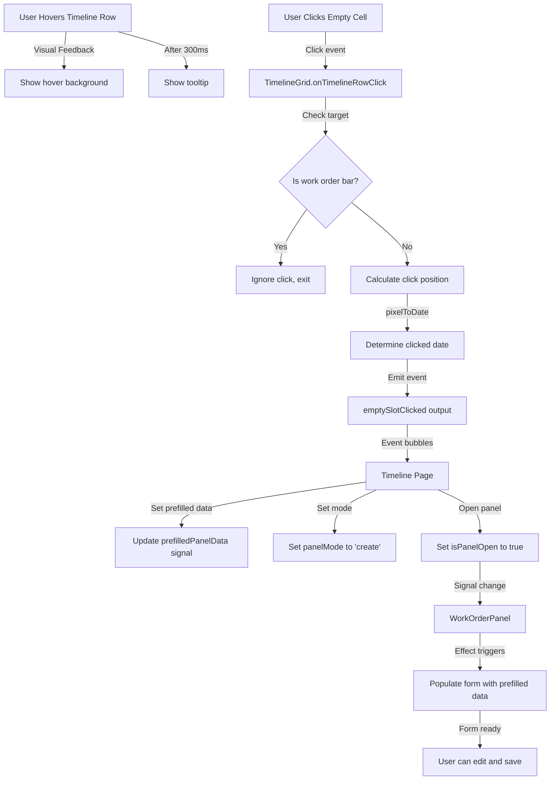

# Phase 6: Interactions Implementation Prompt

## Context

We need to implement the final core interaction: **clicking empty timeline areas to create work orders**. This phase completes the interactive functionality by allowing users to initiate work order creation by clicking on the timeline grid. Most other interactions (three-dot menu, edit, delete, panel close) were already implemented in Phases 4 and 5.

**Focus Areas:**

1. **Empty timeline cell click detection** (primary feature)
2. **Click position to date/work center calculation**
3. **Visual hover feedback on timeline rows**
4. **Tooltip hints for better UX** (using ng-bootstrap NgbTooltip)
5. **Keyboard shortcuts** (optional enhancement)

**Integration Points:**

- TimelineGrid (detect empty cell clicks)
- Timeline page (manage panel state, pass prefilled data)
- WorkOrderPanel (receive prefilled work center and date)

**Purpose:** Enable users to quickly create new work orders by clicking directly on the timeline where they want the work order to be scheduled.

## Requirements

### Technical Standards

- ✅ Angular 21 standalone components
- ✅ OnPush change detection strategy
- ✅ Signal-based state management
- ✅ New control flow syntax (`@if`, `@for`, `@switch`)
- ✅ BEM naming convention for CSS classes
- ✅ TypeScript strict mode compliance (no `any` types)
- ✅ **Use ng-bootstrap NgbTooltip** for hover hints
- ✅ Event handling with proper types

### Interaction Requirements

#### 1. Empty Cell Click Detection

**Behavior:**

- User clicks on empty area of timeline row
- System detects: which work center row, which date/time position
- System opens create panel with prefilled work center and date
- Should NOT trigger when clicking on existing work order bar

**Click Target:**

- The timeline row area (excluding work order bars)
- Visual feedback on hover to indicate clickable area

**Data Calculation:**

```typescript
interface ClickData {
  workCenterId: string;
  clickDate: Date;
  clickX: number; // Pixel position for date calculation
}

function calculateClickData(
  event: MouseEvent,
  workCenter: WorkCenterDocument,
  dateRangeStart: Date,
  columnWidth: number,
  zoomLevel: ZoomLevel
): ClickData {
  // Calculate which date was clicked based on pixel position
  // Account for zoom level (day/week/month)
  // Return work center ID and calculated date
}
```

#### 2. Visual Hover States

**Timeline Row Hover:**

- Background color change when hovering over empty timeline area
- Cursor: pointer
- Smooth transition (0.15s)
- Should NOT show hover when over existing work order bar

**Row Hover Specs:**

- Default background: transparent
- Hover background: rgba(241, 243, 245, 0.5) (#f1f3f5 with 50% opacity)
- Transition: background 0.15s ease
- Only on timeline portion (not left panel work center name)

**Cursor States:**

- Pointer cursor on empty cells (indicating clickable)
- Default cursor on work order bars (they have their own hover)

#### 3. NgbTooltip Hints (Optional Enhancement)

**Using @ng-bootstrap/ng-bootstrap NgbTooltip:**

**Empty Cell Tooltip:**

- Text: "Click to create work order"
- Position: top
- Trigger: hover
- Delay: 300ms (not too aggressive)
- Only show on empty timeline cells, not on bars

**Work Order Bar Tooltip (Optional):**

- Text: Full work order name (if truncated)
- Status information
- Date range
- Position: top
- Trigger: hover

**Example Usage:**

```html
<div
  class="timeline-grid__row-clickable"
  [ngbTooltip]="'Click to create work order'"
  placement="top"
  [openDelay]="300"
  (click)="onEmptyCellClick($event)"
>
  <!-- Timeline content -->
</div>
```

#### 4. Keyboard Shortcuts (Optional)

**Shortcuts:**

- `N` key: Open create panel (default to first work center, current date)
- `ESC` key: Close panel (already implemented)
- `E` key: Edit selected work order (future enhancement)

**Implementation:**

```typescript
@HostListener('document:keydown', ['$event'])
onKeyDown(event: KeyboardEvent) {
  // Only if panel is not already open and no input is focused
  if (event.key === 'n' && !this.isPanelOpen() && !this.isInputFocused()) {
    this.openCreatePanelWithDefaults();
    event.preventDefault();
  }
}
```

## Design Reference

**Primary Design File:**

- `brief/design/Work Order Schedule - Default.jpg` - Shows empty timeline areas where clicks should work

**Key Behaviors from Design:**

- Clicking empty space creates work order
- Hover feedback should be subtle but visible
- Timeline should feel interactive and responsive

**Visual Feedback:**

- Hover: Very light gray background (rgba(241, 243, 245, 0.5))
- Cursor: pointer
- Transition: smooth (0.15s)

## Implementation Strategy

### Stage 1: Click Event Structure in TimelineGrid

**Goal:** Set up click event listeners on timeline rows

**Update TimelineGrid Component:**

```typescript
// timeline-grid.ts
export class TimelineGridComponent {
  // ... existing code ...

  // Output for empty cell clicks
  emptySlotClicked = output<{ workCenterId: string; date: Date }>();

  // Method to handle row clicks
  onTimelineRowClick(event: MouseEvent, workCenter: WorkCenterDocument) {
    // Check if click was on work order bar (ignore if so)
    const target = event.target as HTMLElement;
    if (target.closest('app-work-order-bar')) {
      return; // Don't create if clicking on existing bar
    }

    // Calculate click position
    const clickData = this.calculateClickPosition(event, workCenter);

    // Emit event
    this.emptySlotClicked.emit({
      workCenterId: clickData.workCenterId,
      date: clickData.date,
    });
  }

  private calculateClickPosition(
    event: MouseEvent,
    workCenter: WorkCenterDocument
  ): { workCenterId: string; date: Date } {
    // Get click position relative to timeline grid
    const timelineElement = event.currentTarget as HTMLElement;
    const rect = timelineElement.getBoundingClientRect();
    const clickX = event.clientX - rect.left;

    // Calculate which date was clicked based on zoom level
    const date = this.pixelToDate(clickX);

    return {
      workCenterId: workCenter.docId,
      date,
    };
  }

  private pixelToDate(pixelX: number): Date {
    const columnWidth = this.columnWidth();
    const zoomLevel = this.zoomLevel();
    const startDate = this.dateRange().start;

    let date: Date;

    switch (zoomLevel) {
      case 'day':
        // Each column = 1 day = 120px
        const daysFromStart = Math.floor(pixelX / columnWidth);
        date = addDays(startDate, daysFromStart);
        break;

      case 'week':
        // Each column = 1 week = 180px
        const weeksFromStart = Math.floor(pixelX / columnWidth);
        date = addWeeks(startDate, weeksFromStart);
        break;

      case 'month':
        // Each column = 1 month = 180px
        const monthsFromStart = Math.floor(pixelX / columnWidth);
        date = addMonths(startDate, monthsFromStart);
        break;

      default:
        date = new Date();
    }

    return date;
  }
}
```

**Verification:** Click events fire correctly, log to console

---

### Stage 2: Update TimelineGrid Template

**Goal:** Add click handlers to timeline rows

**Template Update:**

```html
<!-- timeline-grid.html -->
<div class="timeline-grid">
  <div class="timeline-grid__header">
    <!-- Date columns header -->
    @for (column of dateColumns(); track column.date) {
    <div class="timeline-grid__column-header" [style.width.px]="columnWidth()">
      {{ column.label }}
    </div>
    }
  </div>

  <div class="timeline-grid__body">
    @for (center of workCenters(); track center.docId) {
    <div class="timeline-grid__row">
      <!-- Work center name (left panel) -->
      <div class="timeline-grid__work-center">{{ center.data.name }}</div>

      <!-- Timeline row (clickable area) -->
      <div
        class="timeline-grid__timeline-row"
        [class.timeline-grid__timeline-row--hoverable]="true"
        (click)="onTimelineRowClick($event, center)"
      >
        <!-- Date columns -->
        @for (column of dateColumns(); track column.date) {
        <div class="timeline-grid__cell" [style.width.px]="columnWidth()"></div>
        }

        <!-- Work order bars container -->
        <div class="timeline-grid__bars-container">
          @for (order of getOrdersForCenter(center.docId); track order.docId) {
          <app-work-order-bar
            [workOrder]="order"
            [columnWidth]="columnWidth()"
            [zoomLevel]="zoomLevel()"
            [dateRangeStart]="dateRange().start"
            (editClicked)="onWorkOrderEdit($event)"
            (deleteClicked)="onWorkOrderDelete($event)"
            (barClicked)="onWorkOrderClick($event)"
          />
          }
        </div>
      </div>
    </div>
    }
  </div>
</div>
```

**Verification:** Template renders correctly with click handlers

---

### Stage 3: Timeline Row Hover Styling

**Goal:** Add visual hover feedback to timeline rows

**SCSS Update:**

```scss
.timeline-grid {
  // ... existing styles ...

  &__timeline-row {
    position: relative;
    display: flex;
    transition: background 0.15s ease;

    &--hoverable {
      cursor: pointer;

      &:hover {
        background: rgba(241, 243, 245, 0.5);
      }
    }
  }

  &__cell {
    height: 60px;
    border-right: 1px solid #e9ecef;
    flex-shrink: 0;
  }

  &__bars-container {
    position: absolute;
    top: 0;
    left: 0;
    right: 0;
    bottom: 0;
    pointer-events: none;

    // Re-enable pointer events on bars
    app-work-order-bar {
      pointer-events: auto;
    }
  }
}
```

**Verification:** Timeline rows show hover effect, cursor changes to pointer

---

### Stage 4: Integration with Timeline Page

**Goal:** Connect empty cell clicks to panel opening

**Update Timeline Page:**

```typescript
// timeline.ts
export class TimelineComponent {
  // ... existing code ...

  // Handle empty cell click from grid
  onEmptyCellClick(data: { workCenterId: string; date: Date }) {
    // Set prefilled data for create panel
    this.prefilledPanelData.set({
      workCenterId: data.workCenterId,
      date: data.date,
    });

    // Open panel in create mode
    this.panelMode.set('create');
    this.selectedWorkOrder.set(null);
    this.isPanelOpen.set(true);
  }
}
```

**Update Timeline Template:**

```html
<!-- timeline.html -->
<div class="timeline">
  <app-timeline-header [currentZoom]="currentZoom()" (zoomChanged)="onZoomChanged($event)" />

  <app-timeline-grid
    [workCenters]="workCenters()"
    [workOrders]="workOrders()"
    [zoomLevel]="currentZoom()"
    (workOrderEdit)="onWorkOrderEdit($event)"
    (emptySlotClicked)="onEmptyCellClick($event)"
  />

  <app-work-order-panel
    [isOpen]="isPanelOpen()"
    [mode]="panelMode()"
    [workOrder]="selectedWorkOrder()"
    [prefilledData]="prefilledPanelData()"
    [workCenters]="workCenters()"
    [existingWorkOrders]="workOrders()"
    (closePanel)="onPanelClose()"
    (saveWorkOrder)="onWorkOrderSave($event)"
    (deleteWorkOrder)="onWorkOrderDelete($event)"
  />
</div>
```

**Verification:** Clicking empty cell opens create panel with correct work center and date

---

### Stage 5: NgbTooltip Integration (Optional Enhancement)

**Goal:** Add helpful tooltips for better UX

**Update TimelineGrid:**

```typescript
// timeline-grid.ts
import { NgbTooltipModule } from '@ng-bootstrap/ng-bootstrap';

@Component({
  selector: 'app-timeline-grid',
  standalone: true,
  imports: [CommonModule, WorkOrderBarComponent, NgbTooltipModule],
  // ...
})
export class TimelineGridComponent {
  // ... existing code ...

  // Tooltip text
  readonly emptySlotTooltip = 'Click to create work order';
}
```

**Update Timeline Template:**

```html
<!-- timeline-grid.html -->
<div
  class="timeline-grid__timeline-row"
  [class.timeline-grid__timeline-row--hoverable]="true"
  [ngbTooltip]="emptySlotTooltip"
  placement="top"
  [openDelay]="300"
  container="body"
  (click)="onTimelineRowClick($event, center)"
>
  <!-- Timeline content -->
</div>
```

**Custom Tooltip Styling (Optional):**

```scss
// Global styles or component styles
::ng-deep .tooltip {
  .tooltip-inner {
    background: #212529;
    color: #ffffff;
    font-size: 0.75rem;
    padding: 6px 10px;
    border-radius: 4px;
    box-shadow: 0 2px 8px rgba(0, 0, 0, 0.15);
  }

  &.bs-tooltip-top .tooltip-arrow::before {
    border-top-color: #212529;
  }
}
```

**Verification:** Tooltip appears on hover after 300ms delay

---

### Stage 6: Prevent Click on Bars

**Goal:** Ensure clicking work order bars doesn't trigger create

**Already Handled in Stage 1, but verify:**

```typescript
onTimelineRowClick(event: MouseEvent, workCenter: WorkCenterDocument) {
  // Check if click was on work order bar
  const target = event.target as HTMLElement;
  if (target.closest('app-work-order-bar')) {
    return; // Exit early, don't emit event
  }

  // ... rest of click handling
}
```

**Verification:** Clicking bars doesn't open create panel, only empty areas do

---

### Stage 7: Date Calculation Edge Cases

**Goal:** Handle edge cases in date calculation

**Edge Cases to Handle:**

1. **Click before visible date range** - Clamp to first visible date
2. **Click after visible date range** - Clamp to last visible date
3. **Scroll position offset** - Account for horizontal scroll
4. **Week/Month boundary clicks** - Round to appropriate start date

**Updated Calculation:**

```typescript
private pixelToDate(pixelX: number): Date {
  const columnWidth = this.columnWidth();
  const zoomLevel = this.zoomLevel();
  const startDate = this.dateRange().start;
  const endDate = this.dateRange().end;

  let date: Date;

  switch (zoomLevel) {
    case 'day':
      const daysFromStart = Math.floor(pixelX / columnWidth);
      date = addDays(startDate, daysFromStart);
      break;

    case 'week':
      const weeksFromStart = Math.floor(pixelX / columnWidth);
      date = addWeeks(startDate, weeksFromStart);
      // Snap to start of week
      date = startOfWeek(date);
      break;

    case 'month':
      const monthsFromStart = Math.floor(pixelX / columnWidth);
      date = addMonths(startDate, monthsFromStart);
      // Snap to start of month
      date = startOfMonth(date);
      break;

    default:
      date = new Date();
  }

  // Clamp to visible range
  if (date < startDate) date = startDate;
  if (date > endDate) date = endDate;

  return date;
}
```

**Verification:** All edge cases handled correctly

---

### Stage 8: Keyboard Shortcuts (Optional)

**Goal:** Add keyboard shortcuts for power users

**Implementation:**

```typescript
// timeline.ts
import { HostListener } from '@angular/core';

export class TimelineComponent {
  // ... existing code ...

  @HostListener('document:keydown', ['$event'])
  onKeyDown(event: KeyboardEvent) {
    // Don't trigger if typing in input field
    const target = event.target as HTMLElement;
    if (target.tagName === 'INPUT' || target.tagName === 'TEXTAREA') {
      return;
    }

    // 'N' key - New work order
    if (event.key === 'n' || event.key === 'N') {
      if (!this.isPanelOpen()) {
        this.openCreatePanelWithDefaults();
        event.preventDefault();
      }
    }

    // 'ESC' key - Close panel (if not already handled by panel)
    if (event.key === 'Escape') {
      if (this.isPanelOpen()) {
        this.onPanelClose();
        event.preventDefault();
      }
    }
  }

  private openCreatePanelWithDefaults() {
    // Default to first work center and today
    const firstWorkCenter = this.workCenters()[0];
    if (!firstWorkCenter) return;

    this.prefilledPanelData.set({
      workCenterId: firstWorkCenter.docId,
      date: new Date(),
    });

    this.panelMode.set('create');
    this.selectedWorkOrder.set(null);
    this.isPanelOpen.set(true);
  }
}
```

**Verification:** Keyboard shortcuts work as expected

---

### Stage 9: Visual Feedback Polish

**Goal:** Add subtle animations and transitions

**Enhanced Hover Effect:**

```scss
.timeline-grid {
  &__timeline-row {
    position: relative;
    display: flex;
    transition: all 0.15s ease;

    &--hoverable {
      cursor: pointer;

      &:hover {
        background: rgba(241, 243, 245, 0.5);
        box-shadow: inset 0 0 0 1px rgba(86, 89, 255, 0.1);
      }

      // Add subtle indicator on hover
      &:hover::before {
        content: '+';
        position: absolute;
        left: 50%;
        top: 50%;
        transform: translate(-50%, -50%);
        font-size: 2rem;
        color: rgba(86, 89, 255, 0.2);
        pointer-events: none;
        z-index: 0;
      }
    }
  }
}
```

**Verification:** Hover effects are smooth and visually appealing

---

### Stage 10: Testing & Edge Cases

**Goal:** Ensure all interactions work correctly

**Test Scenarios:**

1. **Click empty cell in Day view** - Opens panel with correct date
2. **Click empty cell in Week view** - Opens panel with week start date
3. **Click empty cell in Month view** - Opens panel with month start date
4. **Click on work order bar** - Does NOT open create panel
5. **Click on work center name** - Does NOT open create panel (only timeline area)
6. **Hover over empty cell** - Shows hover effect and tooltip
7. **Hover over work order bar** - Bar's own hover, not row hover
8. **Keyboard shortcut 'N'** - Opens create panel with defaults
9. **Multiple rapid clicks** - Doesn't cause issues (debounce if needed)
10. **Click while panel open** - Doesn't open another panel

**Performance Check:**

- No lag when hovering over rows
- Click response is immediate
- No memory leaks from event listeners
- Tooltips don't slow down interactions

**Verification:** All test scenarios pass

---

## Data Flow



## Testing Checklist

**Functionality:**

- [ ] Click empty timeline cell opens create panel
- [ ] Correct work center prefilled
- [ ] Correct date prefilled (based on click position)
- [ ] Click on work order bar does NOT open create panel
- [ ] Click on work center name (left panel) does NOT open create panel
- [ ] Works correctly in Day zoom view
- [ ] Works correctly in Week zoom view
- [ ] Works correctly in Month zoom view
- [ ] Hover shows visual feedback (background change)
- [ ] Tooltip appears after 300ms delay
- [ ] Tooltip text: "Click to create work order"
- [ ] Keyboard shortcut 'N' opens create panel with defaults
- [ ] Keyboard shortcut 'ESC' closes panel
- [ ] Multiple clicks don't cause issues
- [ ] Click while panel open doesn't open second panel

**Design Accuracy:**

- [ ] Hover background: rgba(241, 243, 245, 0.5)
- [ ] Cursor: pointer on empty cells
- [ ] Transition: 0.15s ease
- [ ] Tooltip styling matches design
- [ ] Visual feedback is subtle and professional

**Code Quality:**

- [ ] TypeScript strict mode passes
- [ ] OnPush change detection working
- [ ] All signals properly typed
- [ ] Event handlers properly typed
- [ ] BEM naming consistent
- [ ] No console errors or warnings
- [ ] No memory leaks from event listeners

**Integration:**

- [ ] TimelineGrid emits correct event data
- [ ] Timeline page handles event correctly
- [ ] WorkOrderPanel receives prefilled data
- [ ] Form populates with work center and date
- [ ] Save creates work order at clicked position
- [ ] All zoom levels work correctly

## Definition of Done

- [x] Click empty timeline cell functionality implemented
- [x] Click position to date calculation working (all zoom levels)
- [x] Click prevented on work order bars
- [x] Click prevented on work center names
- [x] Visual hover feedback on timeline rows
- [x] Cursor changes to pointer on empty cells
- [x] NgbTooltip integrated (optional but recommended)
- [x] Tooltip shows "Click to create work order"
- [x] Integration with Timeline page complete
- [x] Prefilled data flows to WorkOrderPanel
- [x] Keyboard shortcuts implemented (optional)
- [x] Edge cases handled (boundaries, scroll, etc.)
- [x] All zoom levels tested (Day, Week, Month)
- [x] Design matches expectations (subtle, professional)
- [x] TypeScript strict mode passes (no errors)
- [x] OnPush change detection working correctly
- [x] All signals properly typed
- [x] BEM naming used consistently
- [x] No console errors or warnings
- [x] No performance issues
- [x] Memory bank updated (progress.md, activeContext.md)

## After Completion

**Update Memory Bank:**

```markdown
**Recent Changes:**

- Empty timeline cell click functionality
- Click position to date calculation for all zoom levels
- Visual hover feedback on timeline rows
- NgbTooltip integration for UX hints
- Keyboard shortcuts (N for new, ESC for close)
- Event flow: Grid → Timeline Page → Panel
- Prefilled data flows correctly

**Files to Update:**

- progress.md: Mark Phase 6 as complete
- activeContext.md: Document interaction patterns, move focus to Phase 7 (Polish)
- systemPatterns.md: Add click handling patterns, date calculation algorithms

**New Patterns Discovered:**

- Click position to date calculation algorithm
- Event bubbling for user interactions
- Hover state management with pointer-events
- Tooltip integration with ng-bootstrap
- Keyboard shortcut implementation pattern
```

## Common Issues & Solutions

### Issue 1: Click Triggers on Work Order Bars

**Cause:** Event bubbling from bar to row  
**Solution:** Check `target.closest('app-work-order-bar')` and exit early

### Issue 2: Date Calculation Off by One

**Cause:** Pixel rounding or column offset  
**Solution:** Use `Math.floor()` for pixel division, account for padding

### Issue 3: Hover Shows on Work Order Bars

**Cause:** Row hover applies to entire row including bars  
**Solution:** Set `pointer-events: none` on bars container, `auto` on bars

### Issue 4: Tooltip Appears Too Quickly

**Cause:** Default tooltip delay is 0ms  
**Solution:** Set `[openDelay]="300"` for better UX

### Issue 5: Scroll Position Affects Click Calculation

**Cause:** Not accounting for horizontal scroll  
**Solution:** Use `getBoundingClientRect()` which accounts for scroll automatically

### Issue 6: Keyboard Shortcuts Trigger in Inputs

**Cause:** Event listener on document captures all keydowns  
**Solution:** Check `event.target.tagName` and ignore INPUT/TEXTAREA

## Notes

- **Click detection is critical** - Must feel responsive and accurate
- **Visual feedback is important** - Users need to know where they can click
- **Tooltips are optional but recommended** - Improves discoverability
- **Test all zoom levels** - Date calculation differs for each
- **Performance matters** - Hover effects should be smooth
- **Keyboard shortcuts enhance UX** - Power users will appreciate them
- **Most interactions already done** - Phase 4 has three-dot menu, Phase 5 has panel

## Quick Command

```
I need to implement Phase 6: Interactions.

Follow the prompt in prompts/phase-6-interactions.md
Work through stages 1-10 sequentially.
After each stage, verify it works before continuing.
Main focus: Click empty timeline cell to create work order.
Test with all three zoom levels (Day, Week, Month).
Ensure clicking existing bars doesn't trigger create.
Add NgbTooltip for better UX (optional but recommended).
When complete, update memory bank with new patterns discovered.
```

## Bonus: Double-Click Enhancement (Optional)

For power users, consider implementing double-click to edit:

```typescript
onTimelineRowDblClick(event: MouseEvent, workCenter: WorkCenterDocument) {
  const target = event.target as HTMLElement;
  const barElement = target.closest('app-work-order-bar');

  if (barElement) {
    // Double-click on bar - open edit
    // Get work order from bar component
    // this.onWorkOrderEdit(workOrder);
  } else {
    // Double-click on empty cell - quick create without panel?
    // Or same behavior as single click
  }
}
```

This enhances productivity but is not required for MVP.

## NgbTooltip Configuration

**Add to app.config.ts:**

```typescript
import { NgbConfig } from '@ng-bootstrap/ng-bootstrap';

export const appConfig: ApplicationConfig = {
  providers: [
    // ... other providers
    provideBootstrapConfig(),
  ],
};

function provideBootstrapConfig() {
  return {
    provide: NgbConfig,
    useFactory: () => {
      const config = new NgbConfig();
      config.animation = true;
      return config;
    },
  };
}
```

This ensures smooth tooltip animations across the application.
